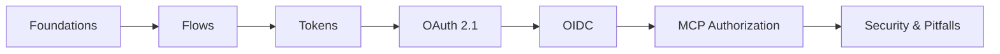

# OAuth 2.0 — A Deep-Dive Reference, with OIDC, OAuth 2.1, and MCP

> A protocol-level guide for technically literate readers. Comprehensive but practical: *what OAuth is*, *why it evolved the way it did*, *which flow to pick*, *how OpenID Connect layers on top*, and *how OAuth 2.1 is being adapted for the Model Context Protocol*.

---

## How this is organised

The material is split into short, focused pages. Read top-to-bottom for a course-like flow, or jump straight to a topic.

## Contents

### Foundations

1. [What OAuth actually is (and isn't)](docs/01-what-is-oauth.md)
2. [Core concepts and vocabulary](docs/02-concepts-vocabulary.md)
3. [The OAuth timeline — how we got here](docs/03-timeline.md)

### The flows

4. [The flows — overview and decision tree](docs/flows/README.md)
   - 4.1 [Authorization Code (+ PKCE)](docs/flows/authorization-code-pkce.md)
   - 4.2 [Implicit (deprecated)](docs/flows/implicit.md)
   - 4.3 [Resource Owner Password Credentials (deprecated)](docs/flows/password.md)
   - 4.4 [Client Credentials](docs/flows/client-credentials.md)
   - 4.5 [Refresh Token](docs/flows/refresh-token.md)
   - 4.6 [Device Authorization Grant (RFC 8628)](docs/flows/device-grant.md)
   - 4.7 [JWT Bearer assertion grant (RFC 7523)](docs/flows/jwt-bearer.md)
   - 4.8 [SAML 2.0 Bearer assertion grant (RFC 7522)](docs/flows/saml-bearer.md)
   - 4.9 [Token Exchange (RFC 8693)](docs/flows/token-exchange.md)
   - 4.10 [CIBA — Client-Initiated Backchannel Authentication](docs/flows/ciba.md)

### Tokens and the ecosystem

5. [Tokens, in detail](docs/05-tokens.md)
6. [The OAuth ecosystem — supporting RFCs](docs/06-rfc-reference.md)

### OAuth 2.1 and OIDC

7. [OAuth 2.1 — what consolidated, what died](docs/07-oauth-2.1.md)
8. [OpenID Connect (OIDC) — the authentication layer](docs/08-oidc.md)

### OAuth 2.1 for MCP — the dedicated section

9. [MCP authorization — overview](docs/mcp/README.md)
   - 9.1 [Architecture and role split](docs/mcp/01-architecture.md)
   - 9.2 [The discovery chain (RFC 9728 → RFC 8414)](docs/mcp/02-discovery-chain.md)
   - 9.3 [Dynamic Client Registration in MCP (RFC 7591)](docs/mcp/03-dynamic-client-registration.md)
   - 9.4 [Resource indicators — RFC 8707 and audience binding](docs/mcp/04-resource-indicators.md)
   - 9.5 [The full handshake, end to end](docs/mcp/05-handshake.md)
   - 9.6 [What an MCP server actually has to implement](docs/mcp/06-server-implementation.md)
   - 9.7 [Common MCP-auth pitfalls](docs/mcp/07-pitfalls.md)
   - 9.8 [Beyond bearer — DPoP and Token Exchange for agents](docs/mcp/08-beyond-bearer.md)

### Security and reference

10. [Security considerations and common pitfalls](docs/10-security.md)
11. [Further reading](docs/11-further-reading.md)

---

## Conventions used in this guide

- **HTTP examples** show real wire-level requests and responses, with TLS assumed throughout.
- **Sequence diagrams** use Mermaid; GitHub renders them inline.
- **RFC numbers** are cited the first time a mechanism is introduced and again in the reference table.
- **"MUST", "SHOULD", "MAY"** carry their RFC 2119 meanings when applied to specs being summarised.

## Audience

You should be comfortable reading HTTP, JSON, JWT, and skimming RFCs. The guide does not assume prior OAuth experience but does assume you have built or operated something on the web.

---

*Maintained as a living document. The OAuth 2.1 draft is at -15 (March 2026); the MCP authorization spec is tracked against the 2025-11-25 stable and the 2026-07-28 release candidate.*
