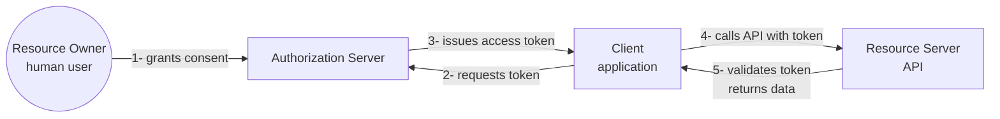

# 1. What OAuth actually is (and isn't)

> **In one line:** What OAuth is: a way to let an app use part of your account on another service without ever handing that app your password.
>
> **Why it matters:** It is the single idea everything else in this guide builds on. Grasp this and the rest is detail.

OAuth 2.0 is an **authorization-delegation framework**. Its job is to let a *client* (some application) obtain limited, scoped access to a *resource* (an API) on behalf of a *resource owner* (usually a human user), without that client ever seeing the resource owner's credentials.

The mental model that pays off: **OAuth hands the client application a stamped ticket** (the same "Client application" box in the diagram above) that says "this much, for this long, against that API." Your password stays with the login service alone — *neither* the client application *nor* the API ever sees it.

## What OAuth is not

**It is not authentication.** OAuth tells an API "this request is allowed to read mailbox `philippe@…`." It does *not* tell the client *who the user is*. That's what [OpenID Connect (OIDC)](08-oidc.md) layers on top, by adding an `id_token` (a JWT about the user) and a `/userinfo` endpoint.

**It is not a single protocol.** It's a framework. RFC 6749 leaves many choices (token format, opaque vs JWT, refresh-token rotation policy, signing algorithms…) to the implementer. That flexibility is both the source of OAuth's reach and the source of most of its security problems.

**It is not "log in with Google."** That phrase is OIDC. People conflate them constantly because every consumer "social login" stack is OIDC on top of OAuth 2.0 authorization code.

## Why a framework at all

Before OAuth, the standard way for "give app X access to my data on service Y" was for the user to hand over their Y password to X. This had three problems compounded:

1. X now has the user's password (catastrophic if X is breached).
2. The user can't revoke X's access without changing the password — which breaks every other app.
3. X gets *all* of the user's privileges, not a scoped subset.

OAuth replaces "give the app my password" with "let the app ask the service for a stamped ticket on my behalf, valid for a narrow purpose, revocable at any time."

That single inversion is what the rest of the protocol exists to make safe at scale.

---

← [README](../README.md) · → Next: [Core concepts and vocabulary](02-concepts-vocabulary.md)
