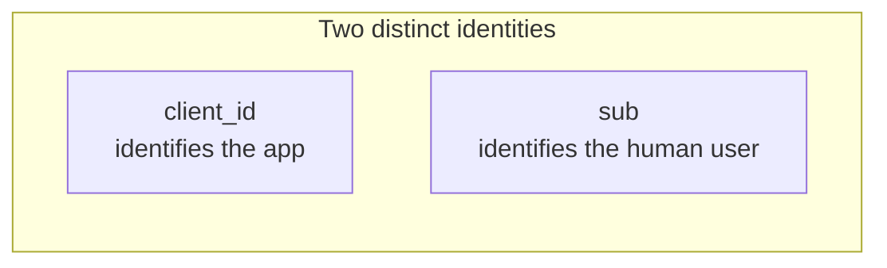

# 2. Core concepts and vocabulary

| Term | Meaning |
|---|---|
| **Resource Owner** | The entity (usually a human) who owns the data and grants access. |
| **Client** | The application requesting access. Categorized as **public** (cannot keep a secret — SPAs, native apps, CLIs) or **confidential** (can keep a secret — server-side web apps, machine services). |
| **Authorization Server (AS)** | Issues tokens after authenticating the resource owner and obtaining their consent. Operates `/authorize` and `/token` endpoints. |
| **Resource Server (RS)** | The API holding the protected data. Validates access tokens on every request. |
| **Access Token** | The credential the client uses on API calls. Short-lived (minutes to hours). Opaque or JWT. |
| **Refresh Token** | Long-lived credential used to obtain new access tokens without re-prompting the user. Confidential — never exposed to user agents. |
| **Authorization Grant** | The credential representing the resource owner's authorization. The "grant type" names the flow (code, client_credentials, etc.). |
| **Scope** | A space-separated list of strings (`read:mail write:calendar`) constraining what the token may do. |
| **Redirect URI** | The exact URL the AS sends the user back to after authorization. Must be pre-registered. |
| **Audience** | The intended recipient of the token (which RS may accept it). Set by `resource` parameter (RFC 8707) on the token request. |

## A small nuance that trips people up

**The client is the application, not the user.** `client_id` identifies the *application*, not whoever is using it. The resource owner is identified through the authorization step — typically appearing as the `sub` claim on the resulting access token.

## Public vs confidential clients — why it matters

A **confidential** client can keep a secret. It runs in an environment the user does not control: a server-side process, a backend service. It can authenticate to the AS with a `client_secret`, an mTLS cert, or a signed JWT (private_key_jwt).

A **public** client runs somewhere the user (or their browser) sees everything: an SPA in JavaScript, a mobile app, a desktop CLI. A `client_secret` shipped to that environment is not a secret — anyone with the binary can extract it.

The distinction determines:

- Whether `client_secret` is meaningful (no for public clients).
- Whether [PKCE](flows/authorization-code-pkce.md) is the only thing standing between the user and theft of the authorization code (yes for public).
- Whether refresh-token rotation is essential (yes for public).
- Which flows are even available (Client Credentials is confidential-only).

## Tokens at a glance

- **Access tokens** are short-lived (5 min to a few hours). Sent on every API call. Either opaque (validated by introspection) or JWT (validated by signature).
- **Refresh tokens** are long-lived (hours to weeks, sometimes longer for offline access). Sent only to the AS, never to the RS. Should be rotated on every use for public clients.
- **ID tokens** (OIDC only) are JWTs *about the user* — `sub`, `name`, `email`, etc. Consumed only by the client, never sent to the RS.

Three different tokens, three different audiences, three different lifetimes. Mixing them up is one of the most common implementation errors.

---

← [What is OAuth](01-what-is-oauth.md) · ↑ [README](../README.md) · → Next: [The OAuth timeline](03-timeline.md)
