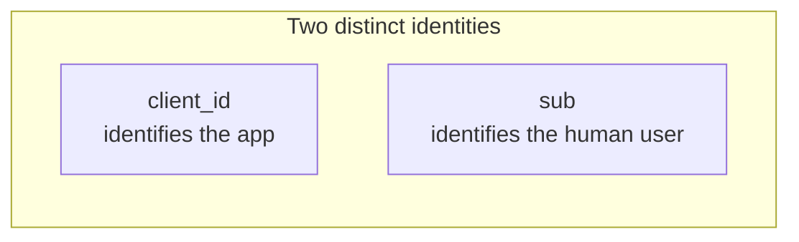
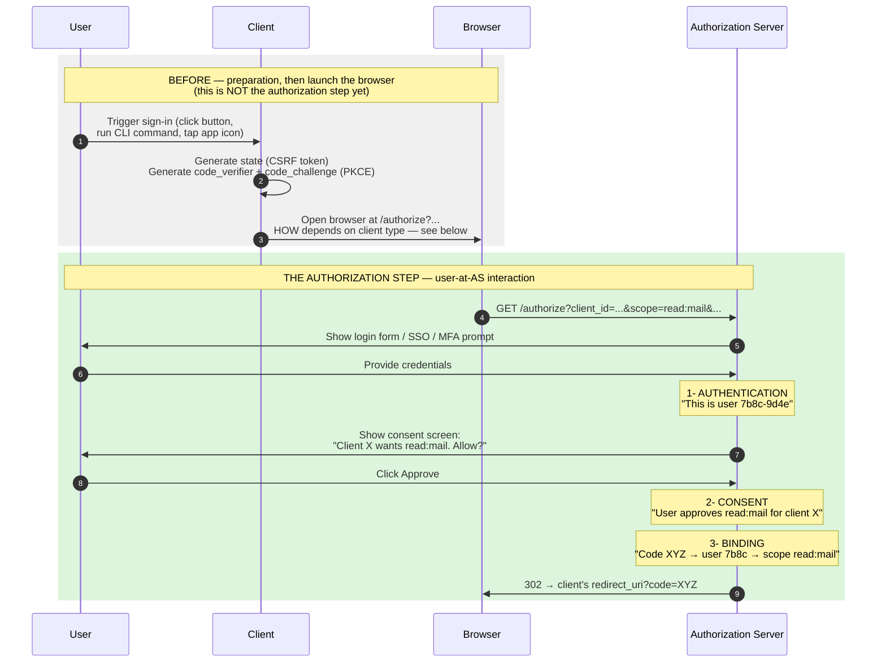
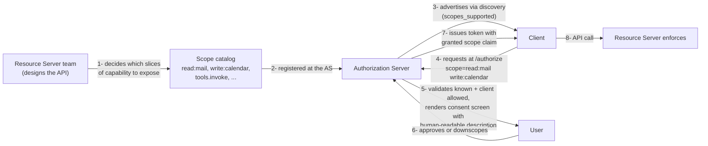

# 2. Core concepts and vocabulary

| Term | Meaning |
|---|---|
| **Resource Owner** | The entity (usually a human) who owns the data and grants access. |
| **Client** | The application requesting access. Categorized as **public** (cannot keep a secret — SPAs, native apps, CLIs) or **confidential** (can keep a secret — server-side web apps, machine services). |
| **Authorization Server (AS)** | Issues tokens after authenticating the resource owner and obtaining their consent. Operates `/authorize` and `/token` endpoints. |
| **Resource Server (RS)** | The API holding the protected data. Validates access tokens on every request. |
| **Access Token** | The credential the client uses on API calls. Short-lived (minutes to hours). Opaque or JWT. |
| **Refresh Token** | Long-lived credential used to obtain new access tokens without re-prompting the user. Confidential — never exposed to user agents. |
| **Authorization Grant** | The credential representing the resource owner's authorization. The "grant type" names the flow (code, client_credentials, etc.). |
| **Scope** | A space-separated list of strings (`read:mail write:calendar`) constraining what the token may do. |
| **Redirect URI** | The exact URL the AS sends the user back to after authorization. Must be pre-registered. |
| **Audience** | The intended recipient of the token (which RS may accept it). Set by `resource` parameter (RFC 8707) on the token request. |

## A small nuance that trips people up

**The client is the application, not the user.** `client_id` identifies the *application*, not whoever is using it. The resource owner is identified during *the authorization step* (explained below), and ends up named in the `sub` claim on the resulting access token.

## The authorization step — where the user comes in

"The authorization step" is the part of the flow where the user interacts directly with the Authorization Server, at its `/authorize` endpoint. It's where their identity is established and they decide whether to grant access. If you take nothing else from this page, take this: **the AS is the only thing that sees the user's credentials. The client never does.**

### How the browser actually gets opened

The greyed-out step *"Open browser at /authorize"* varies by client type — same goal (get the browser to that URL), different mechanism each time:

- **Server-side web app** — the user is already in a browser session with the client. The client's server returns an HTTP `302 Found` with `Location: https://as.example.com/authorize?...`. The browser follows the redirect on its own.
- **Single-page app (SPA)** — runs in the same browser. The client's JavaScript sets `window.location.href = "https://as.example.com/authorize?..."`. Same browser tab navigates away to the AS.
- **Native mobile app** — invokes a system browser component: **ASWebAuthenticationSession** on iOS, **Custom Tabs** on Android. The AS page renders in a browser surface the app cannot read from, which is the whole point — the app must never see the user's AS credentials.
- **Desktop / CLI** — spins up a tiny HTTP server on `http://127.0.0.1:<random-port>/cb` to receive the callback, then opens the user's default browser via `open` (macOS), `xdg-open` (Linux), or `start` (Windows). When the AS redirects to the loopback URL, the local listener captures the code and the CLI proceeds.

In every case the *end state* is the same: the browser is sitting on `/authorize` at the AS, ready for the user to authenticate. Everything in the green block of the diagram is then identical.

Three things happen at the AS during this step, all bundled under the umbrella term *authorization*:

1. **Authentication** — the user proves who they are: password, MFA, SSO redirect to a corporate IdP, passkey, whatever the AS has configured. The AS now has a session for *this specific human*.
2. **Consent** — the AS shows the user "Client X is requesting these scopes" and the user clicks Approve (or scopes it down, or denies).
3. **Binding** — the AS internally records: *this authorization code, when later redeemed at `/token`, should produce an access token whose `sub` claim is this user and whose scopes are these*.

After the redirect back to the client, the client redeems the code at `/token` and the access token it receives carries the user's identity in the `sub` claim. **The client never saw the password** — but it now holds a token that proves "the AS confirms the bearer of this token may act for user `7b8c-9d4e`, within these scopes."

### Where do those scopes come from?

When the consent screen says *"Client X wants `read:mail`. Allow?"*, a fair question is **who decided `read:mail` exists in the first place?** Not OAuth — the spec is silent on what scope strings mean. The list is defined by the people running the deployment.

**Step by step:**

1. **The Resource Server team designs the scopes.** Mail API → `mail.read`, `mail.send`. GitHub → `repo`, `read:org`, `gist`. An MCP server team → `mcp:tools.read`, `mcp:tools.invoke`. The names and grain are chosen by whoever runs the API, based on how they want to slice access.
2. **The scopes are registered at the Authorization Server.** This is operational, not protocol — done via admin console (Auth0, Okta, Entra), a config file (Keycloak), or as part of the app registration process. The AS now knows: *"these strings are valid; here's what each one means in human language; here's which clients may request them."*
3. **The AS advertises the catalog through discovery.** The `/.well-known/oauth-authorization-server` document includes a `scopes_supported` array — a client can read this to know what to ask for without hard-coding it.
4. **The client puts requested scopes in the `/authorize` URL.** Space-separated, like `scope=mail.read mail.send`.
5. **The AS validates and renders consent.** It rejects unknown scopes, rejects scopes this client isn't allowed to request, and looks up each scope's human-readable description to show on the consent screen. *"Read your mail"* is not in the scope string — it's a label the AS stored alongside `mail.read` for display purposes.
6. **The user approves (or partially approves).** Some ASes let users tick individual scopes; others are all-or-nothing.
7. **The token carries the granted scopes.** As a `scope` claim on the access token. Often the same as requested, sometimes less if the user downscoped or AS policy applied.
8. **The Resource Server enforces.** When a token arrives, the RS checks "is `mail.send` in the token's `scope` claim?" and either honours the call or returns `403 insufficient_scope`. The RS is the ultimate authority on what each scope *actually means* in terms of behaviour — the AS just knows the strings.

**A useful way to think about it:** each scope is a contract negotiated between **one or more resource servers** and **one authorization server**. The AS publishes the list; the RS enforces the semantics. OAuth itself just plumbs the strings through.

#### Naming conventions you'll see in the wild

| Style | Example | Where you see it |
|---|---|---|
| **Verb:noun** | `read:mail`, `write:calendar` | Most modern APIs, MCP |
| **Hierarchical** | `repo`, `repo:status`, `read:packages` | GitHub |
| **Full URI** | `https://www.googleapis.com/auth/gmail.readonly` | Google APIs, OIDC standard scopes |
| **Dotted resource** | `Mail.Read`, `Calendars.ReadWrite` | Microsoft Graph / Entra |

None of these is *more correct* — pick a style and stay consistent within your deployment.

#### Standard scopes worth knowing

Defined by OIDC, not OAuth proper, but any AS that does OIDC will recognise them:

- **`openid`** — required. Turns an OAuth flow into an OIDC flow (i.e., return an `id_token`).
- **`profile`** — `name`, `picture`, `locale`, etc.
- **`email`** — `email`, `email_verified`.
- **`offline_access`** — *please give me a refresh token*. Without this, many ASes will issue only an access token.

Custom scopes layer on top normally.

#### MCP scopes

The same machinery, applied to MCP. An MCP server's [Protected Resource Metadata](mcp/02-discovery-chain.md) document publishes its `scopes_supported`. The MCP client reads it during discovery, includes the relevant scopes in the `/authorize` request, and the resulting token carries them. See [§10.2](mcp/02-discovery-chain.md) for the wire-level details.

### The naming-vs-meaning confusion

The OAuth spec calls this *the authorization endpoint* even though most of what happens there is *authentication* plus consent. The naming is historical and a perennial source of confusion:

- **Authentication** answers *"who is this?"*
- **Authorization** answers *"what may they do?"*
- The OAuth `/authorize` endpoint does both — but the term *authorization* in OAuth refers specifically to the delegation step (the user granting the client access), not to authentication.

[OpenID Connect (OIDC)](08-oidc.md) tightens this by adding `auth_time`, `acr` (Authentication Context Class Reference), and `amr` (Authentication Methods References) claims to the id_token. Those claims describe *the authentication part* — what method was used, how long ago, what assurance level — separately from the access-granting part.

### When there is no authorization step

In flows without a human user — [Client Credentials](flows/client-credentials.md), [JWT Bearer](flows/jwt-bearer.md) — there is no `/authorize` endpoint interaction. The "authorization" is just the AS checking the client's own credentials against policy. Those tokens have no `sub` claim, or have `sub == client_id`. This is exactly why those flows cannot stand in for a user: there was no user to authenticate, so the token can't speak for one.

[Device Grant](flows/device-grant.md) splits the authorization step across two devices: the user authenticates at `verification_uri` on their phone while the constrained device polls `/token`. Same logical step, physically separated.

## Public vs confidential clients — why it matters

A **confidential** client can keep a secret. It runs in an environment the user does not control: a server-side process, a backend service. It can authenticate to the AS with a `client_secret`, an mTLS cert, or a signed JWT (private_key_jwt).

A **public** client runs somewhere the user (or their browser) sees everything: an SPA in JavaScript, a mobile app, a desktop CLI. A `client_secret` shipped to that environment is not a secret — anyone with the binary can extract it.

The distinction determines:

- Whether `client_secret` is meaningful (no for public clients).
- Whether [PKCE](flows/authorization-code-pkce.md) is the only thing standing between the user and theft of the authorization code (yes for public).
- Whether refresh-token rotation is essential (yes for public).
- Which flows are even available (Client Credentials is confidential-only).

## Tokens at a glance

- **Access tokens** are short-lived (5 min to a few hours). Sent on every API call. Either opaque (validated by introspection) or JWT (validated by signature).
- **Refresh tokens** are long-lived (hours to weeks, sometimes longer for offline access). Sent only to the AS, never to the RS. Should be rotated on every use for public clients.
- **ID tokens** (OIDC only) are JWTs *about the user* — `sub`, `name`, `email`, etc. Consumed only by the client, never sent to the RS.

Three different tokens, three different audiences, three different lifetimes. Mixing them up is one of the most common implementation errors.

---

← [What is OAuth](01-what-is-oauth.md) · ↑ [README](../README.md) · → Next: [The OAuth timeline](03-timeline.md)
