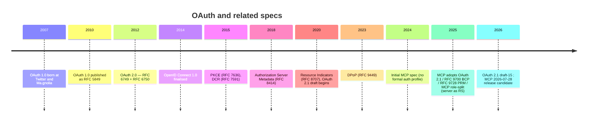

# 3. The OAuth timeline — how we got here

Understanding *why* OAuth 2.1 and the MCP profile look the way they do requires the lineage.

## The narrative

**2007 — OAuth 1.0.** Built at Twitter and Ma.gnolia, formalized as RFC 5849 in 2010. Used HMAC signatures on each request — every API call had to be cryptographically signed by the client. Secure but painful to implement; signature base-string construction was famously brittle.

**2012 — OAuth 2.0 (RFC 6749 + RFC 6750).** A complete rewrite by an IETF working group. The big bet: **TLS is now ubiquitous, so bearer tokens are fine** — drop request signing, send the token in `Authorization: Bearer …`, lean on HTTPS. Defined four canonical flows (Authorization Code, Implicit, Resource Owner Password Credentials, Client Credentials) plus the refresh-token flow. Eran Hammer, the specification’s lead author and editor, famously resigned and called the result "the road to hell" — too many extensibility points, too much left to implementers.

**2014 — OpenID Connect 1.0.** The OpenID Foundation finalised OIDC as an identity layer on top of OAuth 2.0. Added `id_token` (a JWT about the user), `/userinfo`, the `openid` scope, and the `/.well-known/openid-configuration` discovery document that everything else mirrored later. See the [OIDC chapter](08-oidc.md).

**2015 — PKCE (RFC 7636).** "Proof Key for Code Exchange." Patched a critical hole in the authorization-code flow for public clients (mobile, SPA): a malicious app on the same device could intercept the redirect URI and steal the authorization code. PKCE binds the code to a per-request secret the attacker can't replay. Initially mandatory only for native apps; the modern view is "always use it."

**2015 — Dynamic Client Registration (RFC 7591).** Lets a client POST its metadata to the AS and get a freshly minted `client_id` without a human creating an app registration in a dashboard. Critical for federations and (now) MCP.

**2018 — Authorization Server Metadata (RFC 8414).** The `/.well-known/oauth-authorization-server` document. Discovery — clients can find token endpoints, supported scopes, signing keys without hard-coding them. Mirrors the OIDC `/.well-known/openid-configuration` doc that has existed since 2014.

**2020 — Resource Indicators for OAuth 2.0 (RFC 8707).** The `resource` parameter on the authorization and token requests. Lets the client say "this token is for `https://api.example.com`" — the AS can then bind the token's audience, and the RS rejects tokens minted for somebody else. Critical for the multi-tenant world MCP lives in.

**2020 — OAuth 2.0 Security Best Current Practice** (published as RFC 9700 in January 2025). Tightened the screws: PKCE for all clients, exact redirect-URI matching, refresh-token rotation, drop Implicit, drop Password grant.

**2020 → ongoing — OAuth 2.1 (draft-ietf-oauth-v2-1).** Consolidation. Folds 6749, 6750, PKCE, BCP recommendations into one readable document. As of **draft-15 (March 2026)** it's still an Internet Draft on standards track, expected to obsolete RFC 6749 and RFC 6750.

**2023 — DPoP (RFC 9449).** "Demonstrating Proof-of-Possession." Sender-constrained tokens at the application layer. The client signs a small JWT (`DPoP` header) per request proving it holds the key the token was issued to. Tokens stolen from logs or memory no longer work in another client. The lightweight alternative to mutual TLS.

**2025 — Protected Resource Metadata (RFC 9728).** The mirror of RFC 8414 but for the resource server: `/.well-known/oauth-protected-resource` advertises *which authorization servers* are trusted for *which audiences*. This is the keystone that lets MCP servers decouple from any particular AS.

**2024 → 2026 — MCP authorization specification.** First MCP spec (2024-11-05) had no formal auth profile. The 2025-03-26 revision picked OAuth 2.1. The 2025-06-18 revision split the MCP server role from the AS role (MCP server is purely a resource server, points clients at an external AS via RFC 9728). The 2025-11-25 spec further tightened resource-parameter handling. The 2026-07-28 release candidate is the largest revision since launch and aligns more closely with mainstream OAuth/OIDC deployments.

## The throughline

**Every revision narrows the framework's optionality and pushes toward sender-constrained, audience-bound, PKCE-protected, discovery-driven OAuth.** That's the world MCP was designed into.

---

← [Core concepts](02-concepts-vocabulary.md) · ↑ [README](../README.md) · → Next: [The flows — overview](flows/README.md)
