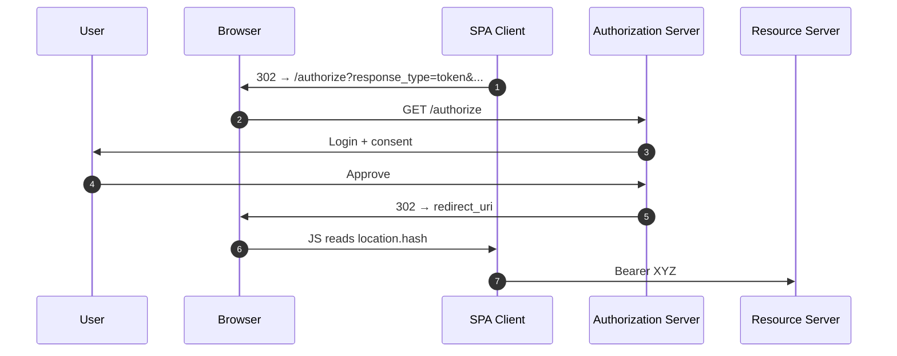

# 4.2 Implicit (deprecated)

> **In one line:** An old, now-retired shortcut that handed access out too freely.
>
> **Why it matters:** You may still find it in older systems. The goal here is to recognise it and know to replace it.

**Status:** removed from OAuth 2.1. If you find this in a codebase today, treat it as a P1 security bug.

**Who this was for:** browser-side SPAs before CORS was widespread on `/token` endpoints. The AS returned the access token directly in the redirect fragment (`#access_token=…`), skipping the back-channel exchange.

> **What is CORS?** *Cross-Origin Resource Sharing* is a browser safety rule: by default, JavaScript running on one site (say `app.example.com`) is **not** allowed to call a server on a different site (say `as.example.com`) unless that server explicitly opts in by sending the right response headers. In the early SPA era, authorization servers didn't send those headers on their `/token` endpoint, so a SPA's JavaScript simply could not make the normal back-channel call to exchange a code for a token. Implicit was the workaround: have the AS hand the token straight back in the redirect URL instead. Once authorization servers added CORS support on `/token`, that workaround was no longer needed, and the safer [Authorization Code + PKCE](authorization-code-pkce.md) flow works fine from browser JavaScript.

## What it looked like



```http
GET /authorize?response_type=token&client_id=…&redirect_uri=…&state=… HTTP/1.1
```

## Why it's dead

- **Access tokens land in browser history**, server logs (referrer headers leak fragments in some configurations), and any extension with URL access.
- **No code-to-token exchange** means no client authentication and (worse) no PKCE protection.
- **No refresh tokens** were issued, so SPAs hit silent-renewal hacks via hidden iframes: themselves an attack surface and broken by modern third-party cookie defaults.
- **Conflated authentication and access** when "OIDC implicit" was used to also return an `id_token` in the fragment, which is even worse because the id_token is then exposed to anything that sees the URL.

## The migration path

[Authorization Code + PKCE](authorization-code-pkce.md). Every major AS now supports CORS on the `/token` endpoint, removing the original reason Implicit existed. Refresh-token rotation gives SPAs a clean offline-access story without iframes.

---

← [Authorization Code + PKCE](authorization-code-pkce.md) · ↑ [Flows](README.md) · → Next: [Password (deprecated)](password.md)
