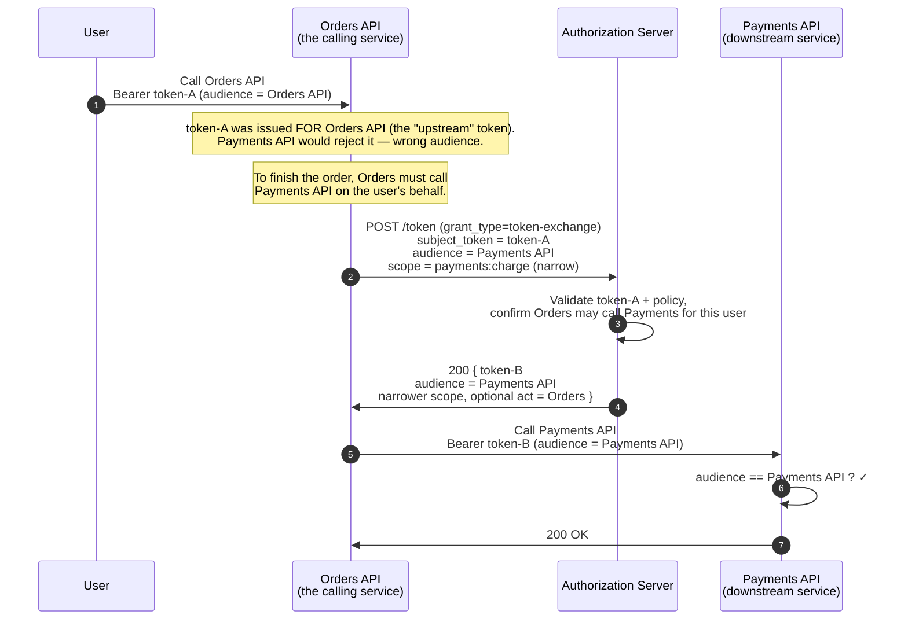
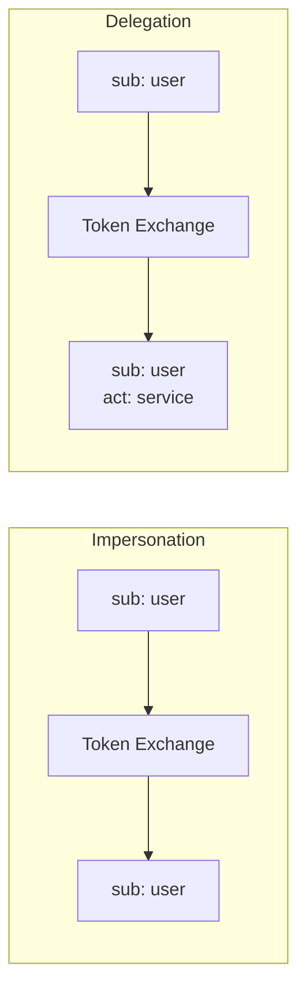

# 4.9 Token Exchange (RFC 8693)

> **In one line:** How a service that already holds your access can trade it for a more limited pass to call another service on your behalf.
>
> **Why it matters:** It is how to give each downstream step only the access it needs, instead of one all-powerful pass: important once AI assistants start chaining tools together.

Trade one token for another. The grant type is `urn:ietf:params:oauth:grant-type:token-exchange`. Two patterns dominate.

**First, the two words that trip people up.** A token is only valid at the service it was issued for (its audience). When one service has to call another to finish a job, it runs into a wall: the token it holds names the wrong audience.

- **Upstream** is the token the calling service *already holds*, issued for itself.
- **Downstream** is the *next* service it now needs to call, which would reject that upstream token.

Token Exchange is how the calling service hands its upstream token to the Authorization Server and gets back a fresh token whose audience is the downstream service, usually with a narrower scope.

## The sequence

A concrete walk-through: a user calls an **Orders API**, which must charge them through a separate **Payments API**.



So `token-A` (good only at Orders) is swapped for `token-B` (good only at Payments, and scoped down to just charging). Orders never gets a token that can do everything; Payments only ever sees a token meant for it.

## The two patterns

**Impersonation:** the service holds the user's token and exchanges it for a narrower-scoped token to call a downstream service. The downstream sees the original user as `sub`. The act of impersonation is not visible to the downstream.

**Delegation:** the new token carries an `act` (actor) claim identifying the service acting on behalf of the user: auditable, distinguishable from direct user access. The downstream can apply different policy to delegated calls (e.g., refuse certain operations when an agent is the actor).



## HTTP

```http
POST /token HTTP/1.1
Host: as.example.com
Content-Type: application/x-www-form-urlencoded

grant_type=urn:ietf:params:oauth:grant-type:token-exchange
&subject_token=eyJ…
&subject_token_type=urn:ietf:params:oauth:token-type:access_token
&audience=https://downstream.example.com
&requested_token_type=urn:ietf:params:oauth:token-type:access_token
&scope=read:profile
```

## Why this is essential for AI agents

An agent that needs to call N tools on a user's behalf has two choices:

1. Pass the same broad-scope token to every tool.
2. Mint per-tool narrowly-scoped tokens via Token Exchange.

Option 1 is a confused-deputy waiting to happen: every tool sees a token that can do everything, and any one tool's compromise gives full account access. Option 2 limits blast radius per tool and produces audit trails that name the agent (via `act`) on every call.

The MCP ecosystem doesn't yet mandate Token Exchange, but enterprise MCP deployments increasingly use this pattern: see [Beyond bearer](../10-mcp/08-beyond-bearer.md).

---

← [SAML Bearer](saml-bearer.md) · ↑ [Flows](README.md) · → Next: [CIBA](ciba.md)
