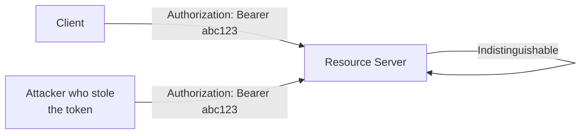
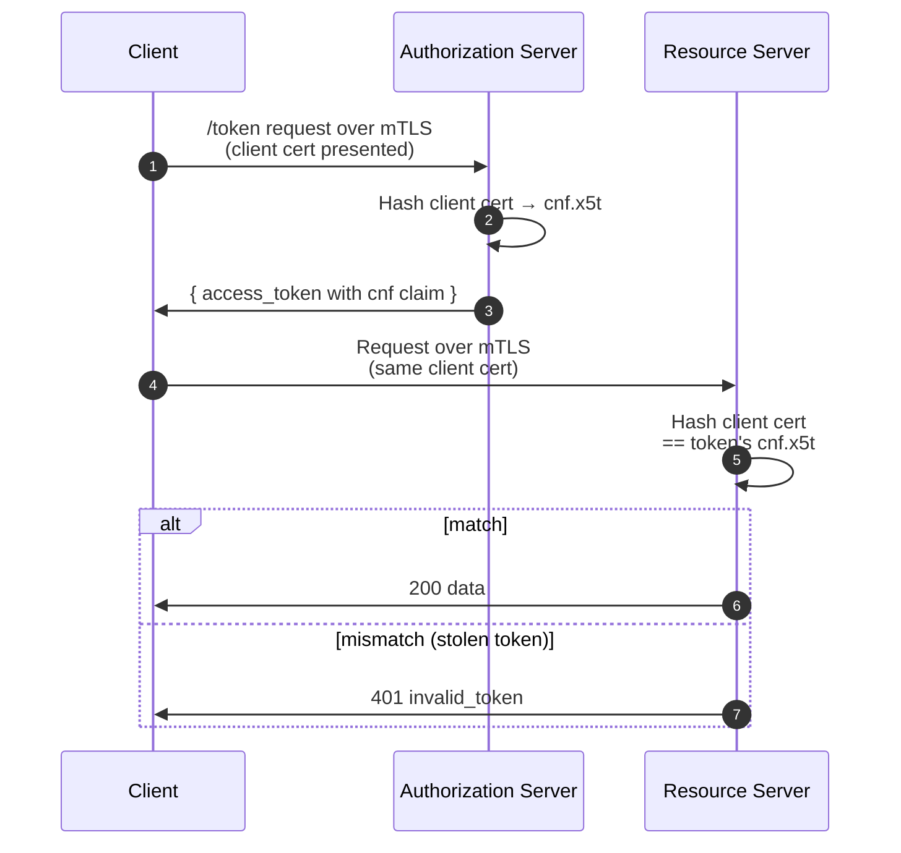
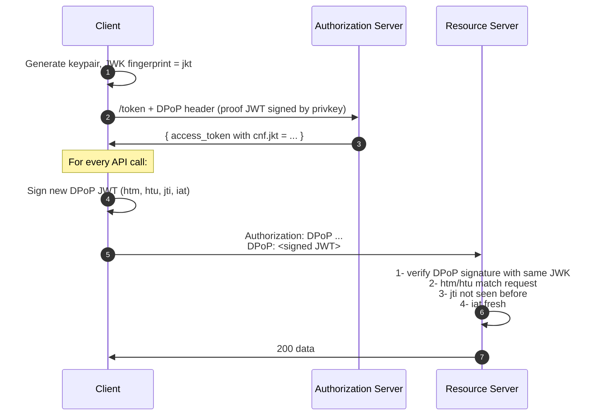
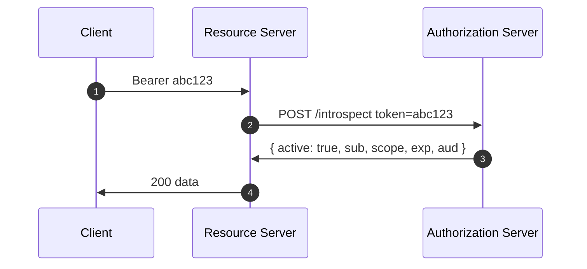

# 5. Tokens, in detail

> **In one line:** The different kinds of access passes the system hands out, and how a service checks that one is genuine.
>
> **Why it matters:** Each kind has its own lifespan and risks. Knowing the differences is what stops a leaked pass from becoming a break-in.

## Bearer tokens (RFC 6750)

The default. Send `Authorization: Bearer <token>`. Whoever has the token can use it. The security model leans entirely on TLS and the assumption that the token never leaks. This was OAuth 2.0's original compromise (dropping request signing for protocol simplicity), and most token-theft incidents trace back to it.



## Sender-constrained tokens

Two production-grade options bind a token to the key that requested it.

### Mutual TLS (RFC 8705)

The TLS client certificate's SHA-256 thumbprint is embedded in the token (`cnf.x5t#S256`). The RS verifies that the connection's client cert matches.



Strongest, but requires mTLS infrastructure end-to-end (load balancers, service meshes, certificate management). Hard at scale.

### DPoP (RFC 9449)

DPoP ("Demonstrating Proof-of-Possession") is the lightweight alternative. On each request the client signs a small **JWT** (a *JSON Web Token*: a short signed JSON document, covered in full in the next section) using a key pair it generated itself. The public half of that key, called a **JWK** (*JSON Web Key*), is tied to the access token when the token is issued. The resource server can then check that every request was signed by the matching private key, which only the legitimate client holds. A stolen token without that private key is useless.



Works through plain HTTPS, through proxies, without certificate provisioning. Much easier to deploy than mTLS. The cost: every RS implementation needs DPoP verification and a per-key `jti` replay cache.

Sender-constraint is rapidly becoming the expectation for high-value APIs. Open-banking, FAPI 2.0, and emerging AI-agent profiles all require it.

## JWT access tokens (RFC 9068)

Stating the obvious: an opaque access token is just a string; a JWT access token is a signed document you can open up and read. RFC 9068 standardises what goes in it.

A JWT is actually **three parts joined by dots** (`header.payload.signature`), and each part is Base64url-encoded (a reversible text encoding, *not* encryption). On the wire it's one long opaque-looking string:

```
eyJhbGciOiJSUzI1NiIsInR5cCI6ImF0K2p3dCJ9.eyJpc3MiOiJodHRwczovL2FzL...0In0.Qm9nYWVydHM-signature-bytes
```

Decode the **first part** and you get the **header**: a couple of fields describing the token itself, namely which algorithm signed it (`alg`) and what type of token it is (`typ`):

```json
{
  "alg": "RS256",
  "typ": "at+jwt"
}
```

Decode the **second part** and you get the **payload**: the actual claims (the facts about who and what the token is for). This is the part shown in most examples:

```json
{
  "iss":       "https://as.example.com",
  "sub":       "user-7b8c…",
  "aud":       "https://api.example.com",
  "client_id": "s6BhdRkqt3",
  "iat":       1748352000,
  "nbf":       1748352000,
  "exp":       1748355600,
  "jti":       "9d2…",
  "scope":     "read:mail",
  "cnf": { "jkt": "0ZcOCORZNYy-DWpqq30jZyJGHTN0d2HglBV3uiguA4I" }
}
```

The **third part** is the **signature**: the resource server recomputes it using the Authorization Server's public key to confirm the token is genuine and hasn't been altered. (Because the first two parts are only *encoded*, not encrypted, anyone can read them; the signature is what makes them trustworthy, not secret.)

JWT access tokens let the RS validate the token without a round-trip to the AS, at the cost of any revocation being delayed until the token expires. Pick short lifetimes (5–15 min) and lean on the `jti` + a deny-list if you need immediate revocation.

**JWT access tokens are not ID tokens.** Some implementations conflate them. Notice the `typ` field in the header above is `at+jwt`, which is what signals "this is an access token, not an id_token." It's a tiny but load-bearing detail: a server that skips this check can be tricked into accepting an ID token (meant only for the app) where an access token was expected.

> **Hands-on lab.** To see this in OpenSSL and bash, the [`jwt_cli`](https://github.com/kubiosec-agentic/JWT_tooling/tree/main/jwt_cli) lab generates an RS256 JWT, prints the three parts, verifies the signature, and publishes the public key as a JWKS. The Python validator there is secure by default (allowlisted `jku`, RS256 pinned, expiry checked) with an explicit `--insecure-trust-jku` flag that demonstrates the JKU-injection forgery covered in the security chapter.

## Token introspection (RFC 7662)

The opposite trade-off: opaque token, RS asks the AS.



```http
POST /introspect HTTP/1.1
Host: as.example.com
Authorization: Basic …
Content-Type: application/x-www-form-urlencoded

token=mF_9.B5f-4.1JqM
```

```http
HTTP/1.1 200 OK
{ "active": true, "scope": "read:mail", "sub": "user-7b8c", "exp": 1748355600 }
```

Use when you need real-time revocation and centralised policy. Cost: latency, and the AS becomes a hot path.

## Pragmatic choices

| Property you care about | Pick |
|---|---|
| Speed, scale, stateless RS | JWT access tokens |
| Instant revocation | Opaque + introspection (cached) |
| Resistance to token theft | DPoP, or mTLS if you have the infra |
| Multi-tenant audience hygiene | JWT + exact-match `aud` (audience) checking, [RFC 8707](06-rfc-reference.md) on issuance |

---

← [CIBA](04-flows/ciba.md) · ↑ [README](../README.md) · → Next: [RFC reference](06-rfc-reference.md)
