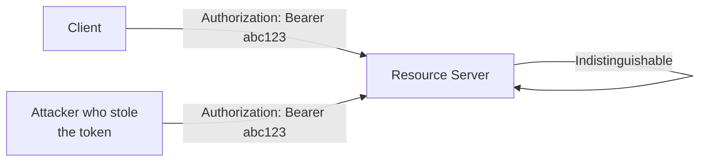
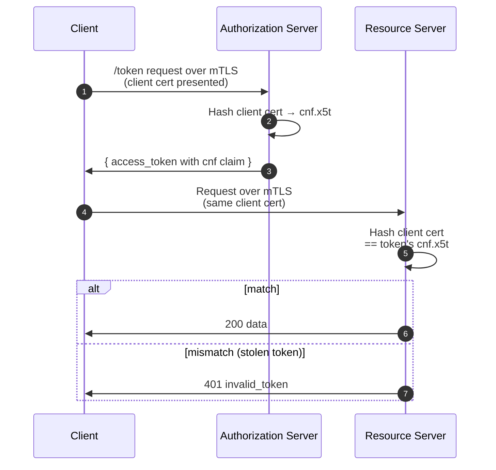
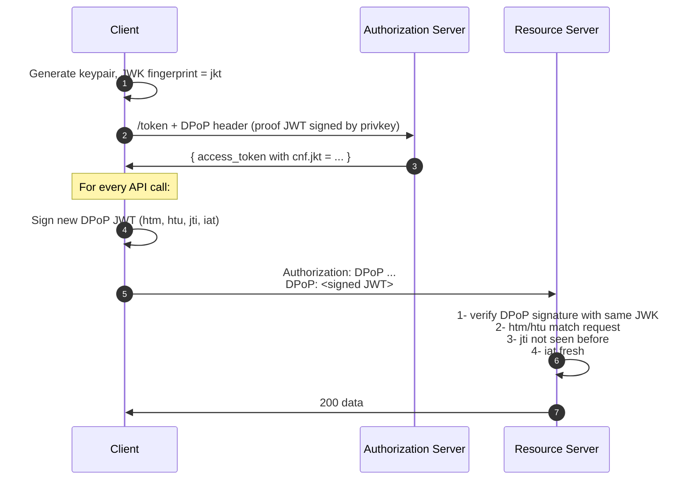
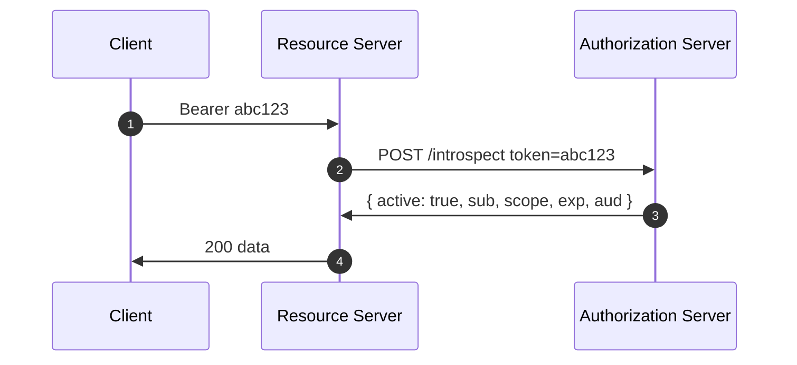

# 5. Tokens, in detail

> **In one line:** The different kinds of access passes the system hands out, and how a service checks that one is genuine.
>
> **Why it matters:** Each kind has its own lifespan and risks. Knowing the differences is what stops a leaked pass from becoming a break-in.

## Bearer tokens (RFC 6750)

The default. Send `Authorization: Bearer <token>`. Whoever has the token can use it. The security model leans entirely on TLS and the assumption that the token never leaks. This was OAuth 2.0's original compromise — drop request signing for protocol simplicity — and most token-theft incidents trace back to it.



## Sender-constrained tokens

Two production-grade options bind a token to the key that requested it.

### Mutual TLS — RFC 8705

The TLS client certificate's SHA-256 thumbprint is embedded in the token (`cnf.x5t#S256`). The RS verifies that the connection's client cert matches.



Strongest, but requires mTLS infrastructure end-to-end (load balancers, service meshes, certificate management). Hard at scale.

### DPoP — RFC 9449

DPoP ("Demonstrating Proof-of-Possession") is the lightweight alternative. The client signs a small JWT per request with a JWK it bound to the token at issuance.



Works through plain HTTPS, through proxies, without certificate provisioning. Much easier to deploy than mTLS. The cost: every RS implementation needs DPoP verification and a per-key `jti` replay cache.

Sender-constraint is rapidly becoming the expectation for high-value APIs. Open-banking, FAPI 2.0, and emerging AI-agent profiles all require it.

## JWT access tokens (RFC 9068)

Stating the obvious: an opaque access token is just a string; a JWT access token is a signed JSON document. RFC 9068 standardises the claims.

```json
{
  "iss":       "https://as.example.com",
  "sub":       "user-7b8c…",
  "aud":       "https://api.example.com",
  "client_id": "s6BhdRkqt3",
  "iat":       1748352000,
  "nbf":       1748352000,
  "exp":       1748355600,
  "jti":       "9d2…",
  "scope":     "read:mail",
  "cnf": { "jkt": "0ZcOCORZNYy-DWpqq30jZyJGHTN0d2HglBV3uiguA4I" }
}
```

JWT access tokens let the RS validate the token without a round-trip to the AS — at the cost of any revocation being delayed to token expiry. Pick short lifetimes (5–15 min) and lean on the `jti` + a deny-list if you need immediate revocation.

**JWT access tokens are not ID tokens.** Some implementations conflate them. The header should say `typ: "at+jwt"` to signal "this is an access token, not an id_token" — a tiny but load-bearing detail.

## Token introspection (RFC 7662)

The opposite trade-off — opaque token, RS asks the AS.



```http
POST /introspect HTTP/1.1
Host: as.example.com
Authorization: Basic …
Content-Type: application/x-www-form-urlencoded

token=mF_9.B5f-4.1JqM
```

```http
HTTP/1.1 200 OK
{ "active": true, "scope": "read:mail", "sub": "user-7b8c", "exp": 1748355600 }
```

Use when you need real-time revocation and centralised policy. Cost: latency, and the AS becomes a hot path.

## Pragmatic choices

| Property you care about | Pick |
|---|---|
| Speed, scale, stateless RS | JWT access tokens |
| Instant revocation | Opaque + introspection (cached) |
| Resistance to token theft | DPoP, or mTLS if you have the infra |
| Multi-tenant audience hygiene | JWT + strict `aud` validation, [RFC 8707](06-rfc-reference.md) on issuance |

---

← [CIBA](flows/ciba.md) · ↑ [README](../README.md) · → Next: [RFC reference](06-rfc-reference.md)
