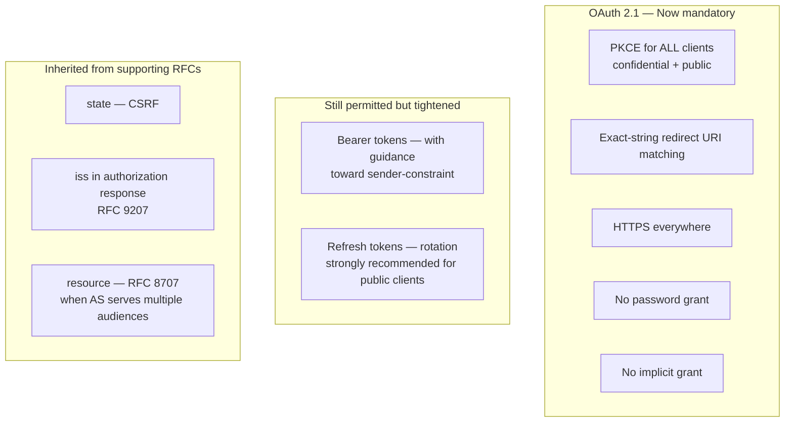
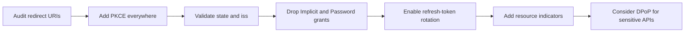

# 7. OAuth 2.1 — what consolidated, what died

> **In one line:** The latest tidy-up of the standard — it removes the unsafe old options and makes the safe practices the default.
>
> **Why it matters:** If you are building something new, this is the version to follow. This page lists what changed and what is now off-limits.

OAuth 2.1 (draft-ietf-oauth-v2-1, currently at **-15** as of March 2026, intended status: Standards Track) does not invent new mechanisms. It is a **rewrite that obsoletes RFC 6749 and RFC 6750** by folding in the best-practice consensus that had accumulated.

## What changed at a glance

## Now mandatory

- **PKCE for all clients** using the authorization code flow — confidential and public alike. (RFC 6749 made it optional; RFC 9700 made it BCP; 2.1 makes it normative.)
- **Exact-string redirect-URI matching.** No wildcards, no prefix matching, no `localhost`-special-casing.
- **HTTPS** for all endpoints. Always was best practice; now spec.
- **No password grant.**
- **No implicit grant.**

## Still permitted but tightened

- Bearer tokens, but with explicit guidance toward sender-constraint where the threat model warrants.
- Refresh tokens, with rotation strongly recommended for public clients.

## Carried in from supporting RFCs

- `state` (CSRF) on authorization requests.
- `iss` (RFC 9207) on authorization responses, to defend against mix-up attacks.
- Resource indicators (RFC 8707) when the AS serves multiple resources.

## What this means practically

**If you're implementing OAuth today, target OAuth 2.1 and you will be on the right side of every security review for the next decade.** The draft is not yet a Standards-Track RFC, but its substance is already incorporated in major frameworks (Spring Authorization Server, Keycloak, Auth0, Entra, etc.), and the FAPI 2.0 and [MCP authorization](mcp/README.md) profiles both reference it normatively.

## Migrating from OAuth 2.0

In that order. Each step is a discrete change that's easy to gate behind a feature flag and roll out incrementally.

---

← [RFC reference](06-rfc-reference.md) · ↑ [README](../README.md) · → Next: [OIDC](08-oidc.md)
