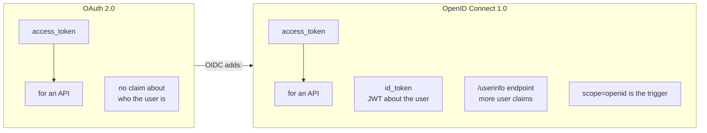
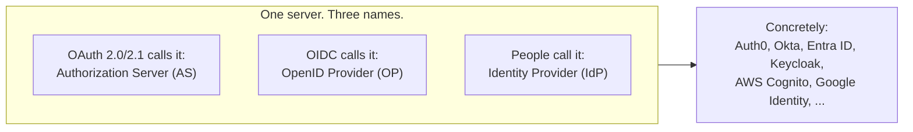
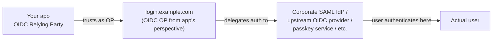
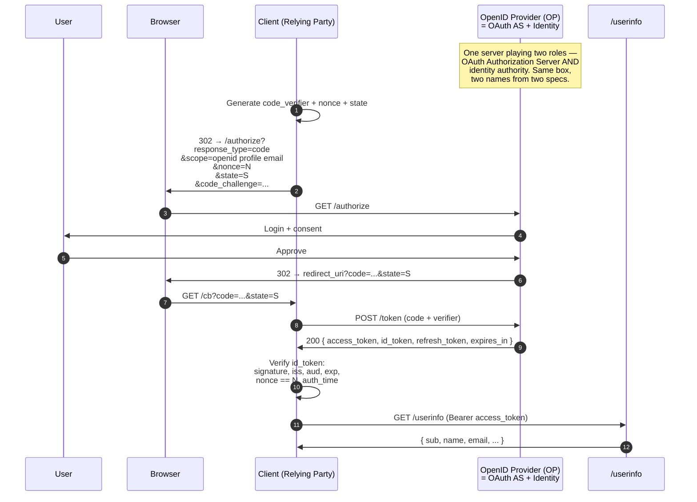
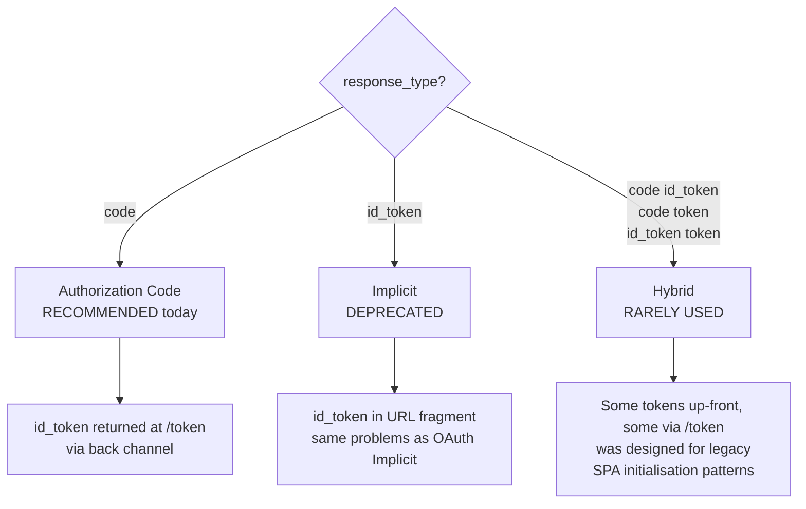

# 8. OpenID Connect (OIDC) — the authentication layer

OAuth 2.0 is about **authorization** — "this client may do that thing." OpenID Connect (OIDC) is the standard layer on top that adds **authentication** — "this is who the user is, and here is verifiable proof."

OIDC 1.0 was finalised by the OpenID Foundation in 2014. It's where "Sign in with Google", "Sign in with Apple", and the entire enterprise SSO industry live. Every consumer-facing social-login button you've clicked is OIDC.

## OAuth vs OIDC, in one diagram



OIDC reuses the OAuth flows verbatim. The only protocol-level change at the wire is:

- The client adds `scope=openid` to the authorization request.
- The token response now includes `id_token` alongside `access_token`.
- A `/userinfo` endpoint, callable with the `access_token`, returns additional claims about the user.

## A small terminology map — OP, AS, IdP

This is the single most common source of confusion when reading OIDC documentation: **the same server has three different names depending on which spec or community is writing**.



In an OIDC-capable deployment — which is almost every modern deployment — these are not different servers. They are different *names for the same component*, chosen by different specs at different times:

| Term | Spec / community | Emphasises |
|---|---|---|
| **Authorization Server (AS)** | OAuth 2.0, OAuth 2.1 (IETF) | The OAuth side: issues access tokens, handles grants. |
| **OpenID Provider (OP)** | OpenID Connect (OpenID Foundation) | The OIDC side: also issues `id_token`, has `/userinfo`. |
| **Identity Provider (IdP)** | Colloquial, predates both. Also a SAML term. | The role: this is where users authenticate. |

When this guide's diagrams label something `OP` or `AS` or write `(AS + Identity)` next to a participant, all three refer to the same box in your architecture. The same server runs `/authorize`, `/token`, and `/userinfo`, signs `id_token`s with its own key, and exposes a JWKS endpoint for clients and resource servers to verify those tokens.

### Other OIDC-vs-OAuth term swaps

While we're here:

| OAuth term | OIDC term | Same thing? |
|---|---|---|
| **Client** | **Relying Party (RP)** | Yes. OIDC calls the client an RP because it's "relying on" the OP for identity. |
| **Resource Owner** | **End-User** | Yes. OIDC just uses the more human-readable term. |
| **Authorization Server** | **OpenID Provider** | Yes — when the AS also speaks OIDC. |
| **`/authorize`** | **`/authorize`** | Same endpoint, same role. OIDC just adds `scope=openid` and `nonce` to the request. |
| **`/token`** | **`/token`** | Same endpoint. With `scope=openid`, the response now also contains an `id_token`. |
| (no equivalent) | **`/userinfo`** | OIDC-specific. The RS-style endpoint for additional user claims. |

If you read an OIDC spec and then an OAuth spec back-to-back, you'll see the same flow described twice with different terms. The wire bytes are identical.

### When the OP isn't actually the identity authority

A subtle layer worth flagging for completeness: the OP/IdP doesn't necessarily *own* user credentials. In federated setups it can delegate authentication further upstream:



From your app's point of view, `login.example.com` is the OpenID Provider — it's the only thing the app talks to. From the *organisation's* point of view, `login.example.com` is a broker; the real identity authority is the SAML IdP upstream. Both views are correct; "OP" is a role relative to a specific client relationship.

In practice this delegation is invisible at the OAuth/OIDC layer — the client just sees a working OP. The complexity lives inside the OP's implementation.

## The id_token

The id_token is a **JWT signed by the AS**. It is consumed by the client only — never sent to a resource server. Its claims tell the client *which user this session represents*.

```json
{
  "iss":       "https://login.example.com",
  "sub":       "user-7b8c-9d4e",
  "aud":       "s6BhdRkqt3",
  "exp":       1748355600,
  "iat":       1748352000,
  "auth_time": 1748352000,
  "nonce":     "n-0S6_WzA2Mj",
  "acr":       "urn:mace:incommon:iap:silver",
  "amr":       ["pwd", "mfa", "otp"],
  "azp":       "s6BhdRkqt3",
  "name":      "Philippe Bogaerts",
  "email":     "philippe.bogaerts@radarsec.com",
  "email_verified": true,
  "picture":   "https://example.com/p.jpg"
}
```

Key claims, in order of how often they bite people:

- **`iss`** — the issuer. The client MUST match it against the AS it expects to be talking to.
- **`aud`** — the intended audience. MUST be (or contain) this client's `client_id`.
- **`exp` / `iat`** — expiry and issuance times.
- **`sub`** — stable identifier for the user *within this issuer*. Use this as the primary key in your user table; never use `email`, which can change.
- **`nonce`** — a value the client included in the authorization request. Required for OIDC flows. The client MUST verify it matches.
- **`auth_time`** — when the user actually authenticated. Different from `iat` if SSO is in play.
- **`acr` / `amr`** — *Authentication Context Class Reference* and *Authentication Methods References*. "How strongly did the user authenticate? Password? MFA?" Increasingly important for step-up flows.
- **`azp`** — *authorized party* — for tokens consumed by multiple audiences, names the one the token was issued *to*.

## OIDC authorization code flow with id_token



## The nonce parameter

Where `state` protects the browser leg from CSRF, **`nonce` binds the id_token to the original authorization request**. The client puts a random value in the `nonce` parameter at `/authorize`; the AS embeds the same value in the id_token's `nonce` claim. On callback, the client verifies the claim matches its stored value.

Without `nonce`, an attacker who phishes a victim into completing an auth flow with the attacker's identity could swap in their own id_token. OIDC mandates `nonce` for flows that return tokens in the front channel and strongly recommends it everywhere.

## Discovery — /.well-known/openid-configuration

OIDC predated OAuth's RFC 8414 by four years. The discovery document looks like:

```http
GET /.well-known/openid-configuration HTTP/1.1
Host: login.example.com
```

```json
{
  "issuer":                                "https://login.example.com",
  "authorization_endpoint":                "https://login.example.com/authorize",
  "token_endpoint":                        "https://login.example.com/token",
  "userinfo_endpoint":                     "https://login.example.com/userinfo",
  "jwks_uri":                              "https://login.example.com/jwks",
  "registration_endpoint":                 "https://login.example.com/register",
  "scopes_supported":                      ["openid", "profile", "email", "offline_access"],
  "response_types_supported":              ["code", "id_token", "code id_token"],
  "subject_types_supported":               ["public", "pairwise"],
  "id_token_signing_alg_values_supported": ["RS256", "ES256"],
  "code_challenge_methods_supported":      ["S256"],
  "claims_supported": ["sub", "iss", "aud", "exp", "iat", "nonce",
                       "name", "email", "email_verified", "picture"]
}
```

Most modern ASes serve both `/.well-known/openid-configuration` and `/.well-known/oauth-authorization-server` with overlapping content.

## OIDC flows

OIDC defines three response types. Two are essentially deprecated for the same reasons their OAuth equivalents are.



Modern practice: **always use Authorization Code + PKCE**, even when the spec technically allows other response_types.

## scope=openid and the standard scopes

OIDC defines a set of standard scopes that any conformant OP must recognise (`openid` is the trigger; `profile`, `email`, `address`, and `phone` request claim bundles; `offline_access` requests a refresh token):

- **`openid`** — required. Trigger that turns an OAuth flow into an OIDC flow.
- **`profile`** — `name`, `family_name`, `given_name`, `picture`, `locale`, etc.
- **`email`** — `email`, `email_verified`.
- **`address`** — postal address.
- **`phone`** — `phone_number`, `phone_number_verified`.
- **`offline_access`** — request a refresh token.

Custom scopes layer on top normally.

## Session management and logout

OIDC also standardises **session management** — how an RP knows when the user has logged out at the OP — and **back-channel logout** (RFC-ish: OpenID Connect Back-Channel Logout 1.0), where the OP POSTs a `logout_token` to each RP that holds an active session. Implementations vary; the standard is well-defined but adoption is partial.

## FAPI — high-assurance OIDC

The **Financial-grade API** profile (now FAPI 2.0) is the OIDC profile used in open-banking and other high-assurance scenarios. FAPI 2.0 builds on OAuth 2.1 and adds:

- **Mandatory sender-constrained tokens** (mTLS or DPoP).
- **Pushed Authorization Requests (PAR — RFC 9126)** so authorization parameters never sit in URLs.
- **JAR (RFC 9101)** — signed authorization requests.
- **No fragment-based response modes.**

If you're building an OAuth/OIDC system that needs to defend against motivated attackers (banking, healthcare, government), FAPI 2.0 is the bar.

## OIDC vs OAuth — picking the right thing

| Question | Use |
|---|---|
| "I need to know who the user is" | OIDC |
| "I need to call an API as the user" | OAuth (often the same flow gets both) |
| "I'm building an SSO portal" | OIDC |
| "I'm an MCP client connecting to an MCP server" | OAuth 2.1 + RFC 8707 (and OIDC for the human login step at the AS) |

In modern stacks, **OIDC and OAuth are issued by the same authorization server in a single flow**: the client requests `scope=openid mcp:tools.invoke` and gets back an `id_token` (knows who the user is) and an `access_token` (calls the API).

---

← [OAuth 2.1](07-oauth-2.1.md) · ↑ [README](../README.md) · → Next: [Workload Identity Federation and Agent Identities](09-workload-identity.md)
