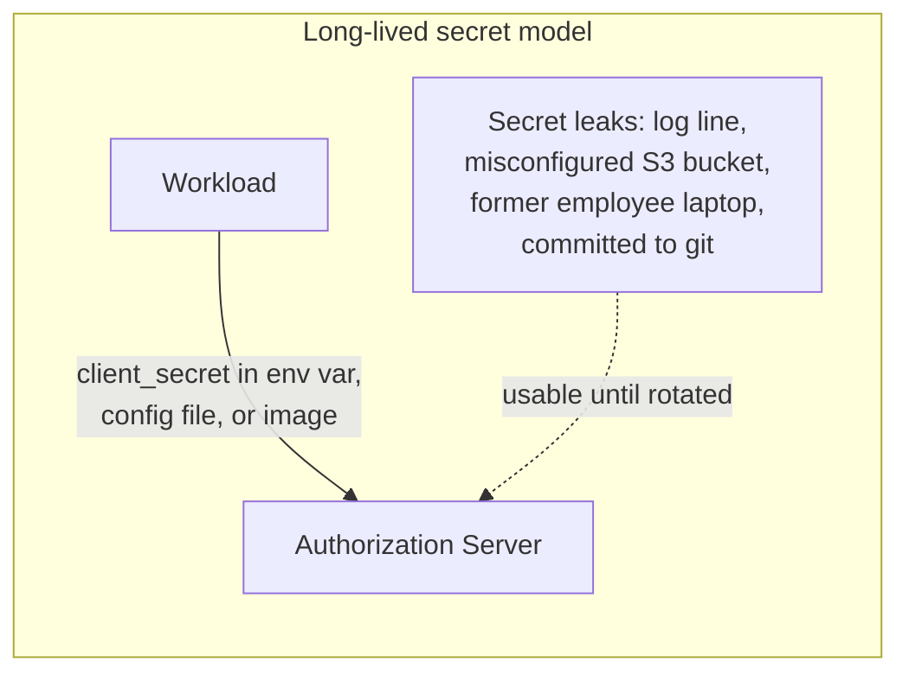
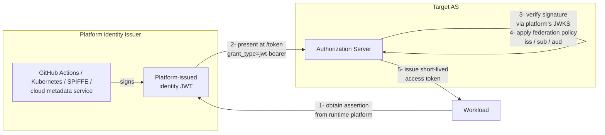
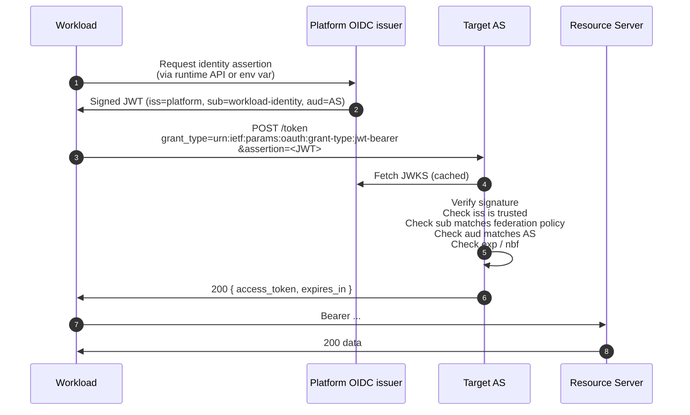
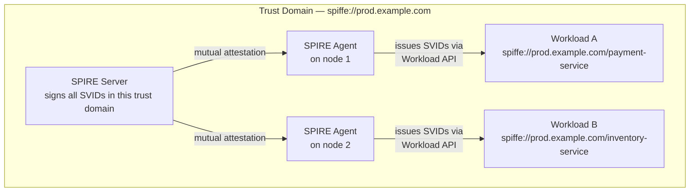
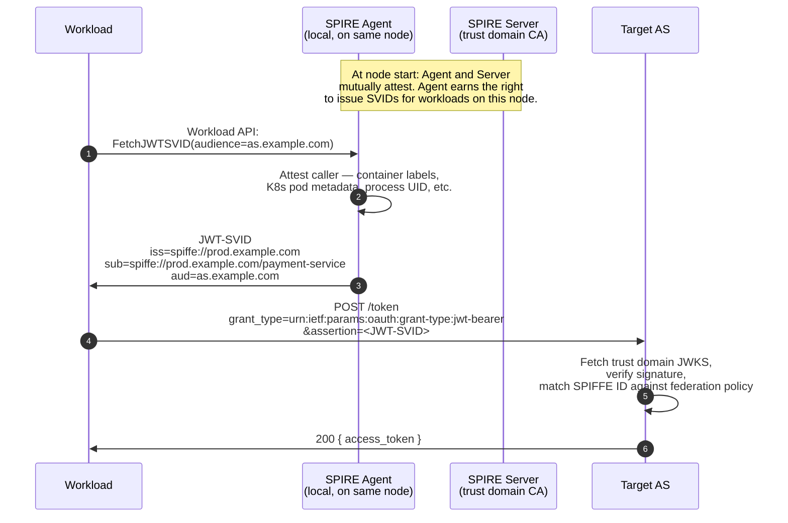
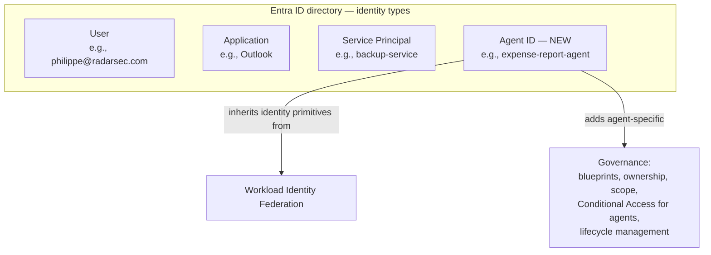
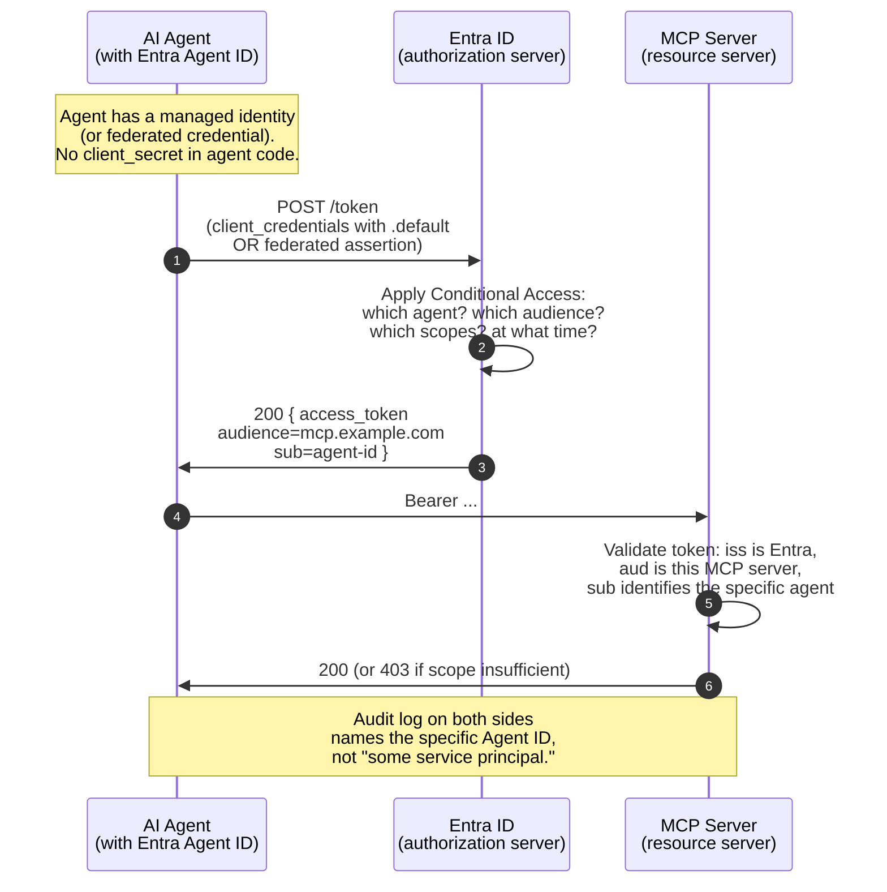
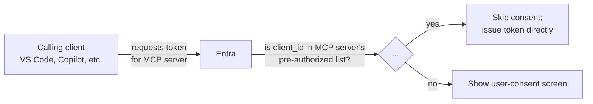
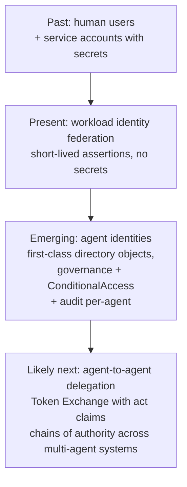

# 9. Workload Identity Federation and Agent Identities

> **In one line:** How machines and automated programs prove who they are to each other without being handed a permanent password.
>
> **Why it matters:** Long-lived passwords leak and rarely get changed. This page covers the modern replacement, including how AI agents get their own identity.

OAuth's original threat model was *user-meets-API*. Over the last decade the dominant question has shifted to *workload-meets-API* and, more recently, *agent-meets-API*. This chapter is about the modern answer to "how does a non-human caller authenticate without long-lived secrets": first the general pattern (Workload Identity Federation), then a vendor-specific implementation that's especially relevant to MCP and AI agents (Microsoft Entra Agent ID).

## 9.1 The problem with long-lived secrets

The naïve way to authenticate a workload, a CI pipeline, a Kubernetes pod, an AI agent service, is to give it a `client_secret`, an API key, or a cloud-provider access key, and let it use that secret directly. This works. It's also the source of most credential-related breaches.



The failure modes are predictable:

- **Secrets get committed to git.** Public repos, internal repos, doesn't matter. GitHub's secret-scanning service alone finds millions per year.
- **Secrets sit in CI environment variables**, log lines, build artifacts, container images, S3 buckets, Slack DMs.
- **Rotation doesn't happen.** Manually rotating a secret across every workload that uses it is expensive enough that teams put it off indefinitely.
- **Audit trails are mush.** A leaked secret is used from the attacker's IP, but the AS just sees "workload-foo authenticated": there's no way to tell legitimate use from attack use.

The whole industry has been steadily moving away from this model.

## 9.2 What Workload Identity Federation is

**Workload Identity Federation (WIF)** is the pattern of *trusting a platform's identity system* instead of issuing each workload its own secret. The workload's identity is asserted by the platform it runs on; the target AS verifies that assertion and issues a short-lived access token.



Three roles:

- **The workload**: a CI job, pod, function, agent. Has no secret of its own.
- **The platform identity issuer**: an OIDC-compatible issuer the workload's runtime trusts and that signs identity assertions. Examples: GitHub Actions' OIDC issuer (`token.actions.githubusercontent.com`), a Kubernetes cluster's API server, AWS IMDS, SPIFFE/SPIRE's SVID issuer, Azure managed identity.
- **The target AS**: whichever Authorization Server the workload needs a token from. Configured to *trust* the platform issuer for specific assertion patterns.

The trust relationship is set up **once, by an administrator**: "Authorization Server X trusts assertions from issuer Y where `sub` matches `repo:my-org/my-repo:ref:refs/heads/main`." From then on, every workflow run gets its own freshly minted assertion, exchanges it at the AS, and runs with a short-lived token. No persistent secret to leak.

## 9.3 How it works on the wire

The OAuth mechanism that implements WIF is the **JWT Bearer assertion grant: [RFC 7523](04-flows/jwt-bearer.md)**. Step by step:



The platform-issued JWT, decoded, looks like this (here for GitHub Actions):

```json
{
  "iss":         "https://token.actions.githubusercontent.com",
  "sub":         "repo:xxradar/oauth-deepdive:ref:refs/heads/main",
  "aud":         "https://sts.amazonaws.com",
  "iat":         1748352000,
  "exp":         1748352600,
  "jti":         "abc-123",
  "repository":  "xxradar/oauth-deepdive",
  "ref":         "refs/heads/main",
  "workflow":    "deploy",
  "actor":       "xxradar",
  "run_id":      "9876543210"
}
```

The interesting claim is `sub`. It precisely names *which workload* this is: *this repo, this branch, this workflow*. The federation policy at the AS pins on this: a trust policy might say "accept assertions where `sub` starts with `repo:xxradar/oauth-deepdive:` and `aud == sts.amazonaws.com`." If anyone tries to use this trust relationship from a different repo or workflow, the `sub` won't match and the AS rejects.

## 9.4 Real-world WIF deployments

The pattern is the same; the platform changes:

| Workload runs on | Platform issuer | Common target | Federation name |
|---|---|---|---|
| **GitHub Actions** | `token.actions.githubusercontent.com` | AWS, GCP, Azure, HashiCorp Vault | "OIDC for AWS / GCP / Azure" |
| **GitLab CI** | GitLab instance | AWS, GCP, Azure | "GitLab JWT auth" |
| **Kubernetes** (any cluster) | Cluster API server | AWS (EKS IRSA), Azure (Workload Identity), GCP | "ServiceAccount token projection" |
| **AWS** (any compute) | IMDS / IAM | Any OIDC-aware service | "IAM Roles Anywhere", cross-account |
| **Azure** managed identity | Entra ID | Any Entra-trusting service | "Managed Identity" |
| **GCP** workload | Google identity | Any OIDC-aware service | "Workload Identity Federation" |
| **SPIFFE/SPIRE** | SPIRE server | Anything that trusts SPIFFE | "SVID JWT" |

The directionality may flow either way: a GitHub Actions workflow obtaining an AWS access token is *workload* (GHA) → *target AS* (AWS STS). A pod in EKS calling Azure is the same shape, different acronyms.

Practical effects:

- **No long-lived secrets in CI.** A pipeline that used to ship `AWS_ACCESS_KEY_ID` now ships a 5-minute identity assertion freshly minted for each job.
- **Auditable.** The `sub` of the assertion identifies exactly which repo, branch, workflow, run produced the call. Audit logs at the AS and the RS can name the source precisely.
- **Revocable per scope.** Remove the federation trust rule and that path stops working immediately. No need to find and rotate every workload's secret.
- **Composable.** A workload can hold multiple federated identities at once (e.g., a CI job that needs AWS and GCP both), each issued just-in-time.

## 9.5 SPIFFE — the vendor-neutral standard

The table above lists SPIFFE/SPIRE as one platform among many, but it deserves its own section because **SPIFFE is the open standard that the rest of WIF rhymes with**. Most cloud-vendor WIF systems implement SPIFFE-compatible (or SPIFFE-influenced) concepts. If you want workload identity without being locked into a particular cloud's identity system, SPIFFE is the answer.

### The acronym, and the projects

- **SPIFFE**, *Secure Production Identity Framework For Everyone*. A specification (CNCF-graduated in 2022) for how workloads should be issued and how they should verify identities. The spec is platform-agnostic, it does not assume Kubernetes, any particular cloud, or any particular language.
- **SPIRE**: *SPIFFE Runtime Environment*. The reference implementation of the SPIFFE spec. Comprises a *SPIRE Server* (the trust domain's signing authority) and *SPIRE Agents* running on each node where workloads execute.

In production you almost always say *"SPIFFE"* when you mean *"SPIRE running the SPIFFE spec"*: the same way people say *"Kubernetes"* when they mean *"kubeadm-installed Kubernetes on these nodes"*.

### Core concepts



- **SPIFFE ID**, a URI of the form `spiffe://<trust-domain>/<path>`. Example: `spiffe://prod.example.com/payment-service`. The workload's identity, full stop. The path is whatever scheme the trust-domain operator picks, by service, by team, by Kubernetes namespace, by environment.
- **Trust Domain**: a unit of administrative authority. Roughly: one organisation, one Kubernetes cluster, one cloud account, or one geographic region. All workloads within a trust domain share its issuing key. Larger deployments have several trust domains that *federate* (mutually exchange trust bundles), so a workload in `prod.example.com` can be verified by a service in `partner.example.org`.
- **SVID**: *SPIFFE Verifiable Identity Document*. The actual credential a workload holds. Two interchangeable formats:
  - **X.509-SVID**: an X.509 certificate where the URI SAN equals the SPIFFE ID. The certificate's CA chain leads back to the trust domain's root. Use this for mTLS connections between workloads.
  - **JWT-SVID**, a JWT with `sub` equal to the SPIFFE ID, signed by the trust domain's key (discoverable via a JWKS endpoint, just like OIDC). Use this as a bearer assertion, including as the `assertion` parameter for [JWT Bearer (RFC 7523)](04-flows/jwt-bearer.md).
- **Workload API**: a local Unix socket (or gRPC endpoint) that the workload calls to fetch its own SVID. The SPIRE Agent on the node decides which SPIFFE ID the workload deserves based on **attestation** (which container image, which K8s pod, which AWS instance, which Linux UID). The workload itself never proves who it is; it just asks the local Agent and trusts what comes back.

### How a workload actually uses it



The workload code path is small: *ask the local Workload API for an SVID with the right audience, send it to the AS*. Everything else is infrastructure.

### How it composes with the rest of this guide

SPIFFE doesn't replace OAuth; it slots into it.

- **JWT-SVID as the `assertion` in [JWT Bearer](04-flows/jwt-bearer.md).** The SPIFFE trust domain is the OIDC-style issuer; the target AS verifies and exchanges for an access token. Standard RFC 7523 mechanics: SPIFFE just standardises the *source* of the assertion.
- **X.509-SVID as the client cert in [mTLS sender-constrained tokens (RFC 8705)](05-tokens.md).** Combine SPIFFE with mTLS-bound OAuth tokens and you get cryptographic identity at both the connection layer and the token layer, end to end.
- **Federation across trust domains.** Two organisations exchange trust bundles; workloads in one can now present SVIDs that workloads (or ASes) in the other will verify. This is how cross-company workload identity works without a shared cloud provider.

### When to reach for SPIFFE vs cloud-vendor WIF

| You want | Pick |
|---|---|
| Single cloud, simple setup, want to use what's already there | Cloud-vendor WIF: GCP WIF, Entra federated creds, AWS IAM OIDC |
| Multi-cloud or hybrid (cloud + on-prem) | SPIFFE/SPIRE |
| Already running Kubernetes and want consistency across workloads | SPIFFE: pods call the Workload API regardless of where the cluster runs |
| Cryptographic identity for service-to-service mTLS | SPIFFE: X.509-SVIDs are designed exactly for this |
| Vendor independence is a hard requirement (regulated, multi-region, exit clauses) | SPIFFE |

For most organisations the answer is "both": cloud-vendor WIF for the obvious cloud-to-cloud paths, SPIFFE for the workload-to-workload connections that don't go through an AS. The two layers compose.

### SPIFFE and agent identity

SPIFFE provides identity *for the process running the agent*, not for *the agent as a governable directory object*. It tells you "this is the `agent-runtime` workload in trust domain X" but doesn't, by itself, encode "this is the *expense-report agent* owned by the finance team, with these permitted tools and this approval lineage." Higher-level identity systems, like [Microsoft Entra Agent ID](#97-microsoft-entra-agent-id), sit *on top* of WIF/SPIFFE and add the directory-object governance that agents specifically need.

The cleanest mental model: **SPIFFE is the lower layer (workload identity)**, **Agent ID is the upper layer (agent governance)**, and a production AI deployment uses both: SPIFFE to authenticate the runtime, Agent ID semantics to authorise the specific agent.

## 9.6 Where WIF meets agents

AI agents are the next category of "non-human caller that needs an identity." A long-running agent process invokes tools, calls APIs, sometimes orchestrates *other* agents: every one of those calls needs to be authenticated and audit-attributable.

The straightforward path is to treat each agent as a workload and apply WIF: the agent runtime mints short-lived assertions, exchanges them at an AS, gets per-call access tokens. This works, but it leaves a gap:

- **Workload identity says "this is process X running on platform Y."**
- **Agent identity needs to also say "this is the agent named Z, owned by team A, with these capabilities."**

The semantic mismatch matters because agents are governed differently from regular services. Regulators, security teams, and end users want to know *which agent* did what, not just *which service*. They want to revoke a specific agent's access without affecting the platform's other workloads. They want to scope an agent's reach by role, conditional access, time of day, data classification.

That's where **agent identity platforms** come in: purpose-built identity types for AI agents that build on WIF principles but add agent-specific governance. The most fleshed-out example as of 2026 is **Microsoft Entra Agent ID**.

## 9.7 Microsoft Entra Agent ID

[Microsoft Entra Agent ID](https://learn.microsoft.com/en-us/entra/agent-id/what-is-microsoft-entra-agent-id) (announced at Microsoft Build 2025, expanded through 2026) is Microsoft's first-class identity type for AI agents inside Entra ID. Where Entra historically modelled *users*, *applications*, and *service principals*, agents now get their own object type with their own lifecycle.



### What it provides

**Agent identity blueprints.** A *blueprint* is a template, "the kind of agent that does X", from which individual agent identities can be instantiated. Blueprints carry parent-child semantics, so an organisation can spin up many agent identities from one governance-controlled template without re-approving each one. ([Overview of agent identities in Entra](https://learn.microsoft.com/en-us/entra/agent-id/agent-identities))

**Standards integration.** Agent ID speaks OAuth 2.0, MCP, and A2A (agent-to-agent) protocols. Tokens issued for agent identities are standard OAuth tokens: the difference is in the directory representation and the policy that produced them, not in the wire format.

**Conditional Access for agents.** The same policy engine that gates user access (block from unmanaged devices, require MFA from new locations, etc.) extends to agents. *"This agent may only invoke the mail tool between 09:00 and 18:00 UTC, only from the prod region, only with tokens audience-bound to mcp.example.com."* The grammar is Conditional Access; the subject is an agent.

**Identity Governance for agents.** Agent identities have *owners*: a human accountable for the agent's behaviour. Access reviews can cover agents the same way they cover service accounts: who owns this, is it still needed, what does it have access to. Stale agent identities get cleaned up via the same lifecycle workflows as stale users.

**Cross-platform.** Despite the Microsoft branding, Entra Agent ID is designed to identify agents built on non-Microsoft platforms too: AWS Bedrock agents, n8n workflows, third-party agent frameworks. The Entra-issued token is just a standard OAuth access token; the agent runtime presents it wherever needed.

### How it composes with MCP

This is where Agent ID becomes particularly interesting for MCP deployments. The MCP authorization profile [requires a separate AS](10-mcp/01-architecture.md) for the MCP server, and the spec is deliberately AS-agnostic: it works with any conformant AS. When that AS is Entra and the calling agent has an Entra Agent ID, several things compose naturally:



The agent obtains its token using Entra's standard mechanisms (managed identity, federated credentials, or, for testing, Client Credentials with a `.default` scope), and Entra's Conditional Access policies gate the issuance based on agent-specific criteria. The MCP server receives a perfectly normal OAuth 2.1 bearer token and validates it the way it would validate any token, *but* the `sub` claim now points to a directory object that says "this is the expense-report agent owned by the finance team." Audit becomes meaningful.

### Pre-authorized clients — the consent shortcut

A practical detail worth knowing: in MCP scenarios where the calling client is well-known (e.g., VS Code, Claude Desktop, Copilot Studio), Entra supports **pre-authorized client applications**. The MCP server's app registration in Entra lists the client app IDs that may request tokens for it *without* triggering a user-consent screen.



This is the right pattern when the trust relationship between the client and the MCP server is already established at the organisation level, an enterprise has decided "VS Code may call our internal MCP servers without per-user consent", and avoiding the consent screen every time is a usability win.

### Limitations and trade-offs worth knowing

- **Vendor-specific.** Entra Agent ID is a Microsoft concept; an equivalent capability in other directories (Okta's emerging agent identity features, Google's IAM workload-identity-for-agents, AWS's Bedrock-agent identity) is *similar in spirit, different in detail*. The OAuth tokens are interoperable; the management plane is not.
- **Governance maturity varies.** As of 2026 the Conditional Access and Identity Governance integrations for Agent ID are functional but still maturing: review and approval workflows for agent ownership, in particular, lag the equivalent flows for human users.
- **Audit-trail responsibility is shared.** Entra logs what tokens it issued; the MCP server logs what it accepted. Stitching those together for a complete picture requires SIEM-level integration, not just Entra alone.

## 9.8 Why this is the direction of travel



The throughline is the same as elsewhere in this guide: **shorter-lived credentials, tighter audience binding, richer identity semantics, fewer secrets to leak.** WIF eliminates the long-lived secret for workloads. Agent ID adds the directory semantics needed to govern agents specifically. The next step, [Token Exchange for agent fan-out](10-mcp/08-beyond-bearer.md), extends this to multi-agent orchestration where one agent calls another and the `act` claim on the resulting token names the entire chain of authority.

For someone building agent infrastructure today, the practical advice is:

1. **Never ship `client_secret` to an agent.** Use a federated identity (Entra Agent ID, GCP WIF, AWS IAM Roles Anywhere, SPIFFE): whichever your platform supports.
2. **Bind every token to a specific MCP-server audience** (RFC 8707). Even if the AS doesn't enforce this strictly, your downstream servers should.
3. **Make agents nameable.** If your audit log says "service-principal-7b8c-9d4e did something," that's not a name. If it says "expense-report-agent (owner: finance@example.com) did something," that is.
4. **Plan for revocation per agent.** Stale or misbehaving agent → revoke its identity → all future tokens fail. Don't tie revocation to rotating a shared secret.

---

← [OIDC](08-oidc.md) · ↑ [README](../README.md) · → Next: [MCP authorization: overview](10-mcp/README.md)
