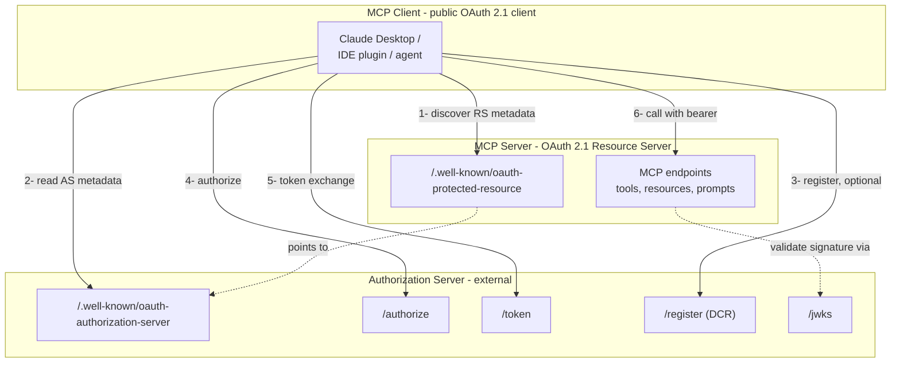

# 10.1 Architecture and role split

> **In one line:** Who does what when an AI assistant connects to a tool: the tool only checks passes, while a separate specialist handles logging people in.
>
> **Why it matters:** This split is the key design choice in the whole section. Once it clicks, everything else here falls into place.

The single most important architectural decision in the MCP authorization spec is that **the MCP server is purely an OAuth 2.1 Resource Server**.

It does *not* mint tokens. It does *not* run an authorization endpoint. It does *not* know how to authenticate users. It delegates all of that to a separate **Authorization Server (AS)**, which can be Entra ID, Okta, Auth0, Keycloak, WorkOS, a homegrown AS, or anything else that speaks the standards.

## Why the split

The original 2025-03-26 MCP spec allowed the MCP server to also be its own AS. That seemed simple at first: fewer hops, less infrastructure. It produced two bad outcomes in practice:

1. **MCP servers reinvented identity, badly.** Implementations bolted on quick `/authorize` endpoints, mishandled refresh tokens, skipped PKCE, conflated `client_id` with `user_id`. Every one of them was a fresh attack surface.
2. **Identity didn't compose with enterprise.** An enterprise customer wanting MFA, conditional access, audit logging from their existing IdP found themselves unable to plug it in. Each MCP server was its own identity silo.

The 2025-06-18 revision **split the roles**. Today:

- **MCP client** ≈ OAuth 2.1 client (typically *public*, since the AI host application, Claude Desktop, an IDE, can't reliably keep secrets).
- **MCP server** ≈ OAuth 2.1 resource server.
- **Authorization server** ≈ any conformant AS, advertised by the MCP server via [RFC 9728](02-discovery-chain.md).

The MCP server is now small in scope: a few hundred lines of token-validation code. The AS does everything heavy. This is the OAuth 2.0 separation of concerns, finally applied properly.

## Implications

- **One MCP server can trust multiple ASes.** The PRM document lists them. An enterprise can run its own AS for employee access while still letting trusted external users authenticate via a SaaS AS: both sets of tokens accepted by the same server, each validated against its own issuer.
- **One AS can serve many MCP servers.** Each MCP server has a distinct canonical URI (used as the `aud` claim: see [§10.4](04-resource-indicators.md)). Tokens are bound to one server's URI and rejected by all others, even though they all trust the same AS.
- **The MCP server never sees credentials.** No passwords, no MFA challenges, no session cookies. Just bearer tokens it validates.

## What about local / stdio MCP servers?

If the MCP server runs as a subprocess of the client (stdio transport), the trust boundary is different, typically the OS process boundary itself. OAuth applies when MCP traffic crosses the network. The 2026-07-28 release candidate clarifies this distinction further.

---

← [A plain-English walkthrough](walkthrough.md) · ↑ [README](../../README.md) · → Next: [The discovery chain](02-discovery-chain.md)
