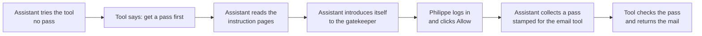

# MCP authorization — a plain-English walkthrough (start here)

> **In one line:** The whole MCP authorization story told once as a simple narrative, one person, one assistant, one tool, before any of the technical detail.
>
> **Why it matters:** The pages after this one go deep on each step. It's much easier to follow them if you already have the overall shape in your head. Read this first; the formal, wire-level version is in [The full handshake](05-handshake.md).

No code or protocol detail here: just the story of what happens and why. Each step links to the page that explains it properly.

## The setup

Philippe uses **Claude Desktop** (an AI assistant app on his laptop). He wants the assistant to be able to read his email so he can ask things like *"what did I miss today?"*

His email is exposed to assistants through a small **email tool**: in this guide's terms, an *MCP server*. Philippe knows only one thing about it: its web address. He pastes that address into Claude Desktop and clicks connect.

Everything below happens automatically in the next few seconds. Philippe sees only a login page and a permission prompt.

## Step 1 — The assistant knocks, and is turned away

Claude Desktop tries to use the email tool straight away, with no pass. The tool answers, in effect: *"You can't come in without a valid pass, and here's where to find out how to get one."*

That polite refusal is the starting gun. It points the assistant at an information page.
→ See [The discovery chain](02-discovery-chain.md).

## Step 2 — The assistant reads the instructions

Following that pointer, the assistant reads two short information pages:

- One published by the **email tool**, saying *"the gatekeeper you should talk to is over here, and these are the permissions I understand"* (like "read mail").
- One published by the **gatekeeper** (the login service), saying *"here's where you log in, here's where you collect a pass."*

Now the assistant knows everything it needs: without Philippe or anyone else having configured it by hand. This automatic learning is the whole point of *discovery*.
→ See [The discovery chain](02-discovery-chain.md) and [Architecture](01-architecture.md) for why the tool and the gatekeeper are kept separate.

## Step 3 — The assistant introduces itself

The gatekeeper has never heard of this copy of Claude Desktop before. So the assistant introduces itself automatically and is recognised: again, with no human having to register it in advance.
→ See [Dynamic Client Registration](03-dynamic-client-registration.md).

## Step 4 — Philippe logs in and gives permission

A login page opens. **This is the only part Philippe actually sees.** He logs into his email account *with the gatekeeper*, not with the assistant. The assistant never sees his password; that's deliberate and is the founding idea of the whole system.

Then he sees a permission screen: *"Claude Desktop wants to read your mail. Allow?"* He clicks **Allow**.
→ See [Authorization Code + PKCE](../04-flows/authorization-code-pkce.md) for how this login stays safe, and the [authorization step](../02-concepts-vocabulary.md#the-authorization-step--where-the-user-comes-in) for what's happening behind the prompt.

## Step 5 — The assistant collects its pass

Having Philippe's approval, the assistant quietly collects an **access pass** from the gatekeeper. Two details matter:

- The pass is **stamped for the email tool only**. If anything tried to use it on a different tool, that tool would reject it. This is what stops one connected tool from quietly reaching into another.
- The pass **expires** after a short while, and comes with a way to renew it without bothering Philippe again.

→ See [Resource indicators](04-resource-indicators.md) for the stamping, and [Refresh Token](../04-flows/refresh-token.md) for the renewal.

## Step 6 — The assistant finally reads the mail

Now the assistant goes back to the email tool, this time holding its valid, correctly-stamped pass. The tool checks the pass, *is it genuine, is it from a gatekeeper I trust, is it stamped for me, has it expired, does it allow reading mail?*, and, satisfied, returns the messages.

Philippe sees: *"You have 2 unread messages…"*. He never knew any of the previous steps happened.
→ See [What an MCP server actually has to implement](06-server-implementation.md) for exactly what the tool checks.

## The shape to remember

Three things worth holding onto:

1. **The tool never handles logins or passwords.** It only checks passes. A completely separate gatekeeper handles logging Philippe in. Keeping those jobs apart is the central design choice: see [Architecture](01-architecture.md).
2. **Philippe's password only ever goes to the gatekeeper**, never to the assistant or the tool.
3. **Each pass is locked to one tool.** With several tools connected at once, this is what keeps them from reaching into each other: see [Resource indicators](04-resource-indicators.md).

When you're ready for the same story with the exact requests, responses, and rules, read [The full handshake](05-handshake.md). For the deepest version, including what changes when the assistant is a more autonomous *agent* juggling several tools, see [The Agent / MCP pattern](09-agent-pattern-end-to-end.md).

---

← [MCP overview](README.md) · ↑ [README](../../README.md) · → Next: [Architecture and role split](01-architecture.md)
