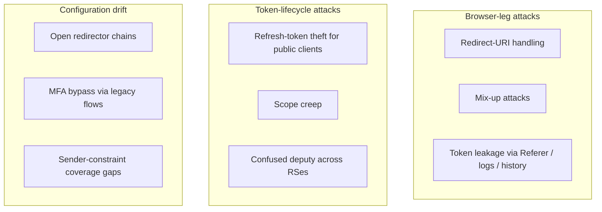
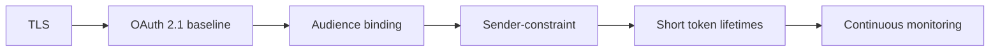

# 11. Security considerations and common pitfalls

Even with OAuth 2.1, you can build something insecure. The recurring failure modes, with their defences.

## The taxonomy

## Redirect-URI handling

Wildcard matching, allowing user-controlled hosts, or failing to compare exact-string. Once an attacker controls the redirect, they own the auth code (and PKCE only helps if they can't also coerce the legitimate verifier).

**Defence:** exact-string matching, no wildcards, no path-prefix matching. RFC 8252 patterns for native apps. Loopback-only for `http://` schemes.

## Mix-up attacks

In a multi-AS deployment, a malicious AS can trick a client into completing the flow with the wrong AS. The client thinks it's talking to AS-A but is in fact authenticating against attacker-AS-B.

**Defence:** RFC 9207 — the AS includes `iss` in the authorization response, and the client verifies it before exchanging the code.

## Token leakage via Referer / logs / browser history

Why Implicit died. Why query-string tokens are forbidden in OAuth 2.1. Why URL fragments are *also* dangerous (some browsers/extensions leak them).

**Defence:** tokens in `Authorization` headers only. Never in URLs, never in form bodies on `GET`. Disable Referer-Policy leakage.

## Public-client refresh-token theft

Without rotation, a stolen refresh token works until it expires. With rotation, the legitimate client's next refresh trips the alarm and the family is revoked.

**Defence:** [refresh-token rotation](flows/refresh-token.md) for all public clients. Short-lived refresh tokens where possible.

## Scope creep

"Read all data" scopes get rubber-stamped because consent UIs are bad. Users approve `full_mailbox` without reading.

**Defence:** design scopes around *actions* (`mail:read:unread`, not `full_mailbox`). Mandate just-in-time consent: don't ask for everything up front, ask for each capability as it's first needed.

## Confused deputy across resource servers

A token issued for RS-A is accepted by RS-B because both trust the same AS and neither validates `aud`. Solved by RFC 8707 + audience validation — but the discipline to actually enforce it is uneven.

The MCP profile is explicit about this; many older deployments are not.

**Defence:** [resource indicators](mcp/04-resource-indicators.md) on every token, `aud` validation on every request.

## Open redirector chains

Combine a misconfigured redirect URI with an open redirector on the same host and you have a token-exfiltration primitive. The legitimate redirect URI points to `/login/callback`, but the page has a `?next=…` parameter that redirects further to attacker-controlled URLs after extracting the code.

**Defence:** don't let your hostname host both an OAuth client and unrelated user-content URLs. If you must, audit every redirect on the OAuth-hosting subdomain.

## MFA bypass via legacy flows

If you've turned off Password grant in your AS, audit your tenants — large orgs sometimes keep it enabled for "legacy migration" indefinitely. The migration is never done.

**Defence:** kill switches on legacy grants at the AS level. Audit usage telemetry. Demand a sunset date for every "temporary" exception.

## Sender-constraint coverage gaps

DPoP only protects requests that present the DPoP header; an old code path that skips it negates the protection. mTLS only protects connections that present the cert. All-or-nothing.

**Defence:** when adopting sender-constraint, enable it as a token policy at the AS, not per-route at the RS. Tokens then *cannot* be issued without the cnf claim, and every RS check is naturally consistent.

## Cross-cutting: defence in depth

None of these alone is sufficient. Together they make a meaningful target.

---

← [The Agent / MCP pattern](mcp/09-agent-pattern-end-to-end.md) · ↑ [README](../README.md) · → Next: [Further reading](12-further-reading.md)
