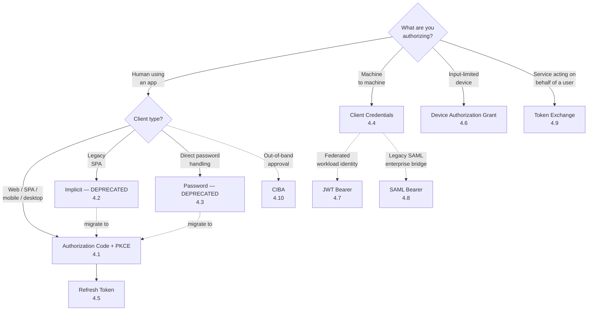
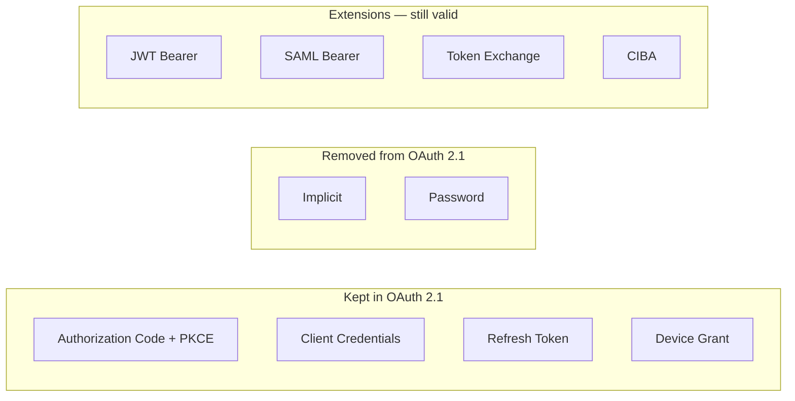

# 4. The flows — overview and decision tree

OAuth 2.0 defined four core grants plus refresh; extensions added several more. OAuth 2.1 retires two of them outright. This page is the map.

## The full set, at a glance

## The decision in plain English

**Building anything that involves a human and a browser?** Authorization Code + PKCE. Full stop. Doesn't matter if your client is a server-side web app, a SPA, a mobile app, or a desktop CLI. Always.

**No human in the loop?** Client Credentials, OR — if you can avoid long-lived client secrets — JWT Bearer (workload identity federation).

**Input-constrained device?** Device Authorization Grant. The TV-screen pattern.

**Your service has a user's token and needs to call a downstream service on their behalf?** Token Exchange. Especially relevant in microservices and AI-agent fan-out.

**Anything else?** Probably wrong. Implicit and Password grants are deprecated and should be migrated away from.

## OAuth 2.1's verdict

## The pages

- 4.1 [Authorization Code (+ PKCE)](authorization-code-pkce.md) — the default
- 4.2 [Implicit (deprecated)](implicit.md)
- 4.3 [Resource Owner Password Credentials (deprecated)](password.md)
- 4.4 [Client Credentials](client-credentials.md)
- 4.5 [Refresh Token](refresh-token.md)
- 4.6 [Device Authorization Grant (RFC 8628)](device-grant.md)
- 4.7 [JWT Bearer assertion grant (RFC 7523)](jwt-bearer.md)
- 4.8 [SAML 2.0 Bearer assertion grant (RFC 7522)](saml-bearer.md)
- 4.9 [Token Exchange (RFC 8693)](token-exchange.md)
- 4.10 [CIBA — Client-Initiated Backchannel Authentication](ciba.md)

---

← [Timeline](../03-timeline.md) · ↑ [README](../../README.md) · → Next: [Authorization Code + PKCE](authorization-code-pkce.md)
