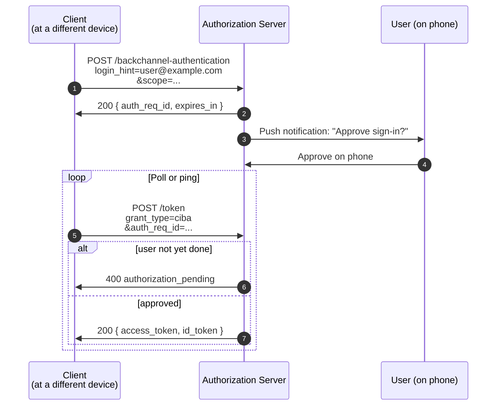

# 4.10 CIBA — Client-Initiated Backchannel Authentication

> **In one line:** A way to start a sign-in on one device and approve it on another — for example, a call-centre agent starts it and you approve on your phone.
>
> **Why it matters:** It is built for cases where the person approving is not sitting at the device making the request. Useful for high-trust confirmations.

OpenID Foundation spec, not strictly an OAuth IETF document, but increasingly relevant.

## The sequence

The client initiates auth *without* the user being at the same device — the AS pushes a notification to the user's phone, the user approves, and the client polls (or receives a ping) at `/token`.

## Where this gets used

- **Banking and call centers.** Customer calls in; agent initiates a flow that the customer approves on their banking app.
- **Voice assistants.** "Hey, transfer $20 to Mom" → assistant initiates CIBA, user confirms on phone.
- **Strong customer authentication** (PSD2 / open-banking regulations in the EU mandate flows close to this).

Worth knowing exists; not yet common in MCP, but a candidate for high-assurance agent confirmations.

---

← [Token Exchange](token-exchange.md) · ↑ [Flows](README.md) · → Next: [Tokens, in detail](../05-tokens.md)
