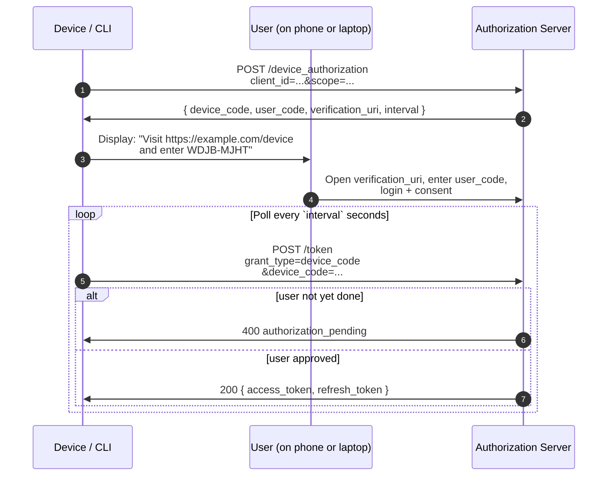

# 4.6 Device Authorization Grant (RFC 8628)

> **In one line:** How you sign in on a device that is awkward to type on — like a TV — by using your phone instead.
>
> **Why it matters:** It is the pattern behind “go to this web address and enter this code.” Handy whenever a screen has no real keyboard.

**Who this is for:** input-constrained devices — TVs, CLIs, IoT — that can display a code but can't reasonably host a browser-redirect flow.

## The sequence



## HTTP

```http
POST /device_authorization HTTP/1.1
Host: as.example.com
Content-Type: application/x-www-form-urlencoded

client_id=s6BhdRkqt3&scope=read:mail
```

```http
HTTP/1.1 200 OK
{
  "device_code":              "GmRhmhcxhwAzkoEqiMEg_DnyEysNkuNhszIySk9eS",
  "user_code":                "WDJB-MJHT",
  "verification_uri":         "https://example.com/device",
  "verification_uri_complete":"https://example.com/device?user_code=WDJB-MJHT",
  "expires_in":               1800,
  "interval":                 5
}
```

Then the device polls `/token`:

```http
POST /token HTTP/1.1
grant_type=urn:ietf:params:oauth:grant-type:device_code
&device_code=GmRhmhcxhwAzkoEqiMEg_DnyEysNkuNhszIySk9eS
&client_id=s6BhdRkqt3
```

Returns `400 authorization_pending` until the user finishes, then a normal token response with `access_token`.

## Used by

- The `gh` (GitHub) CLI
- `aws sso login`
- Apple TV / Roku app authorization
- Smart-TV streaming services
- Most modern terminal-based OAuth flows (better UX than embedded WebViews)

## Practical guidance

- **Show `verification_uri_complete` as a QR code** where possible. Users hate typing 8-character codes on a TV remote.
- **Respect the `interval`** value. Polling faster than the AS asks gets you `slow_down` errors and possibly a temp ban.
- **The `device_code` is sensitive** — anyone who captures it during the poll window can complete the auth. Don't log it.

---

← [Refresh Token](refresh-token.md) · ↑ [Flows](README.md) · → Next: [JWT Bearer](jwt-bearer.md)
