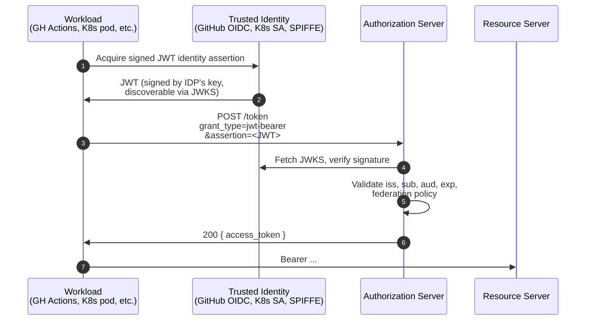

# 4.7 JWT Bearer assertion grant (RFC 7523)

The client presents a *signed JWT* as its grant. Used heavily in cloud federation.

## The sequence



## HTTP

```http
POST /token HTTP/1.1
Host: as.example.com
Content-Type: application/x-www-form-urlencoded

grant_type=urn:ietf:params:oauth:grant-type:jwt-bearer
&assertion=eyJhbGciOiJSUzI1NiIsImtpZCI6IjE2In0...
```

Decoded, the assertion JWT typically looks like:

```json
{
  "iss":  "https://token.actions.githubusercontent.com",
  "sub":  "repo:xxradar/oauth-deepdive:ref:refs/heads/main",
  "aud":  "https://as.example.com",
  "iat":  1748352000,
  "exp":  1748352600,
  "jti":  "abc-123"
}
```

The JWT proves the caller's identity via a key the AS already trusts (often via an OIDC-discoverable JWKS — this is how AWS IAM Roles for Service Accounts, GitHub Actions OIDC, and most CI→Cloud federations work). Replaces long-lived shared secrets with short-lived, audience-bound assertions.

## Why this matters for modern infrastructure

- **No long-lived secrets to leak.** The assertion is generated at request time and lives for seconds.
- **Auditable.** The `sub` of the assertion identifies the workload (this repo, this branch, this pod) precisely.
- **Federation-friendly.** Trust is established once between AS and identity-issuer; every workload under that issuer gains access without per-workload provisioning.

This is the recommended replacement for `client_secret` in CI/CD pipelines, cluster-to-cluster federation, and AI-agent service identity.

---

← [Device Grant](device-grant.md) · ↑ [Flows](README.md) · → Next: [SAML Bearer](saml-bearer.md)
