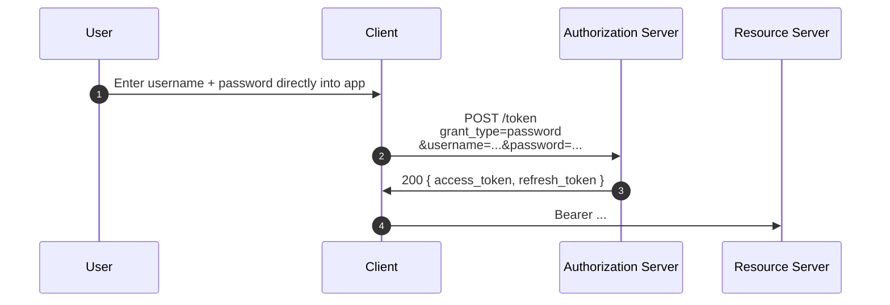

# 4.3 Resource Owner Password Credentials (deprecated)

**Status:** removed from OAuth 2.1. Most major IdPs have either disabled it or restricted it to legacy migration paths.

**Who this was for:** "trusted first-party" apps where the user could type their password into the client itself, which then POSTed it to the AS.

## What it looked like



```http
POST /token HTTP/1.1
Host: as.example.com
Content-Type: application/x-www-form-urlencoded

grant_type=password
&username=philippe
&password=hunter2
&client_id=s6BhdRkqt3
&scope=read:mail
```

## Why it's dead

- **The whole point of OAuth was that the client never sees credentials.** This flow violated that single most important property.
- **It normalised phishing.** Users learned to type their primary password into anything labelled "login," including untrusted apps.
- **MFA, federation, and AS policy controls are all bypassed.** No challenge-response, no risk-based auth, no SSO — the client gets the password and tries it once.
- **Migrations from legacy systems** were the original justification ("our users are already typing passwords here"), but the migration was meant to be temporary and never was.

## The migration path

[Authorization Code + PKCE](authorization-code-pkce.md), with the AS handling the login UI. Where you need a non-interactive machine grant, use [Client Credentials](client-credentials.md) or [JWT Bearer](jwt-bearer.md).

---

← [Implicit](implicit.md) · ↑ [Flows](README.md) · → Next: [Client Credentials](client-credentials.md)
