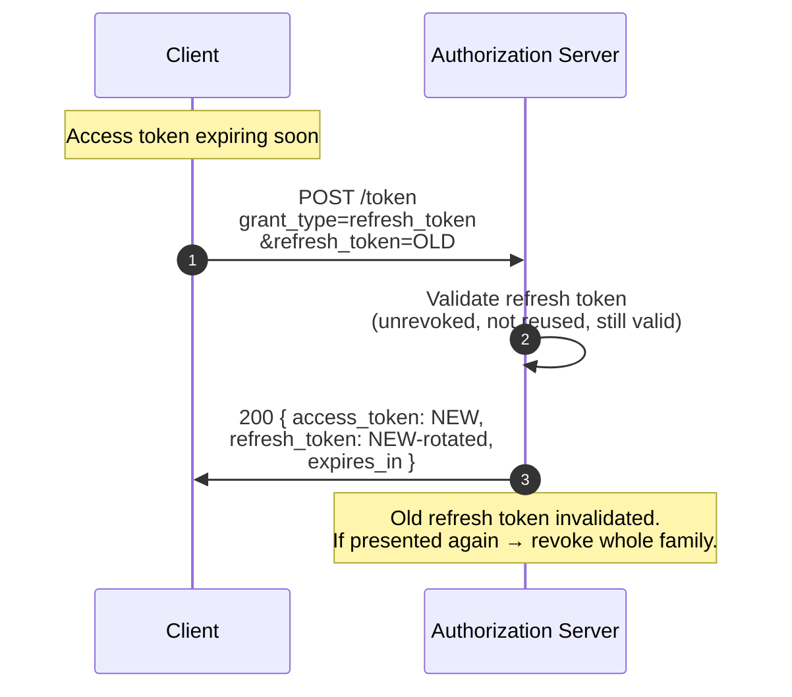
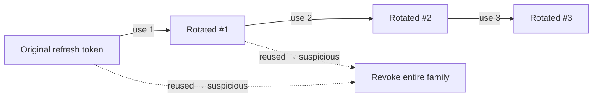

# 4.5 Refresh Token

> **In one line:** How an app quietly gets a fresh pass when the old one expires, without making the user log in again.
>
> **Why it matters:** It is what keeps you signed in for days. Done wrong it is also a favourite target for attackers, so this page shows how to do it safely.

Not a standalone flow — a continuation. The client trades a refresh token for a fresh access token (and ideally a rotated refresh token).

## The sequence



## HTTP

```http
POST /token HTTP/1.1
Host: as.example.com
Content-Type: application/x-www-form-urlencoded
Authorization: Basic …

grant_type=refresh_token
&refresh_token=tGzv3JOkF0XG5Qx2TlKWIA
&scope=read:mail
```

```http
HTTP/1.1 200 OK
{
  "access_token":  "...",
  "expires_in":    3600,
  "refresh_token": "NEW-rotated-value"
}
```

You may **downscope** with `scope=` (request a *narrower* scope than the original) but you may not **upscope**.

## Refresh-token rotation

The modern default: every use returns a new refresh token and invalidates the old one. If an old refresh token is ever used again, the AS treats it as theft, **revokes the entire family**, and forces re-authentication.



This is the only protection that meaningfully limits the blast radius of a stolen refresh token for a public client. Without rotation, a refresh token in a leaked log is good until expiry.

## Where to store refresh tokens

- **Confidential client (server-side):** in a secret store, encrypted at rest, scoped per user.
- **Mobile:** the OS keychain (iOS Keychain, Android Keystore).
- **SPA:** *never* in `localStorage`. Use HTTP-only, Secure, SameSite=Lax cookies issued by a backend-for-frontend, or hold the token only in a service worker memory.
- **Desktop CLI:** OS keychain, or an encrypted file with proper file-mode permissions.

---

← [Client Credentials](client-credentials.md) · ↑ [Flows](README.md) · → Next: [Device Authorization Grant](device-grant.md)
