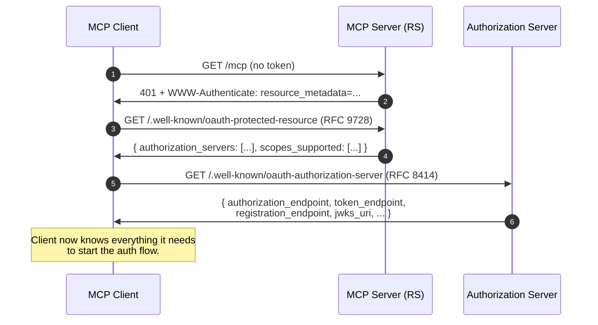
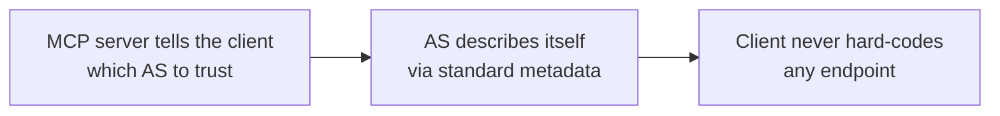

# 9.2 The discovery chain — RFC 9728 → RFC 8414

When a client hits an MCP server without a (valid) token, the server returns:

```http
HTTP/1.1 401 Unauthorized
WWW-Authenticate: Bearer
    resource_metadata="https://mcp.example.com/.well-known/oauth-protected-resource"
```

The client follows the chain: **RS metadata → AS metadata → register → authorize**.



## Step 1 — Protected Resource Metadata (RFC 9728)

The client fetches the PRM document from the MCP server.

```http
GET /.well-known/oauth-protected-resource HTTP/1.1
Host: mcp.example.com
```

```http
HTTP/1.1 200 OK
Content-Type: application/json

{
  "resource":                "https://mcp.example.com",
  "authorization_servers":   ["https://login.example.com"],
  "scopes_supported":        ["mcp:tools.read", "mcp:tools.invoke"],
  "bearer_methods_supported":["header"],
  "resource_documentation":  "https://mcp.example.com/docs",
  "resource_signing_alg_values_supported": ["RS256", "ES256"]
}
```

**Key fields:**

- **`resource`** — the canonical URI of this MCP server. The client will use it as the `resource` parameter in the authorization and token requests (see [§9.4](04-resource-indicators.md)).
- **`authorization_servers`** — the ASes the MCP server trusts. The client picks one (typically the only one, or prompts the user if more than one).
- **`scopes_supported`** — the scopes the MCP server understands. The client uses these in the `scope=` parameter at `/authorize`.
- **`bearer_methods_supported`** — typically `["header"]`. The MCP spec forbids `query` (which would leak tokens to logs).

## Step 2 — Authorization Server Metadata (RFC 8414)

The client now fetches the AS metadata.

```http
GET /.well-known/oauth-authorization-server HTTP/1.1
Host: login.example.com
```

```http
HTTP/1.1 200 OK
Content-Type: application/json

{
  "issuer":                                  "https://login.example.com",
  "authorization_endpoint":                  "https://login.example.com/authorize",
  "token_endpoint":                          "https://login.example.com/token",
  "registration_endpoint":                   "https://login.example.com/register",
  "jwks_uri":                                "https://login.example.com/jwks",
  "code_challenge_methods_supported":        ["S256"],
  "grant_types_supported":                   ["authorization_code", "refresh_token"],
  "response_types_supported":                ["code"],
  "token_endpoint_auth_methods_supported":   ["none", "client_secret_basic"],
  "scopes_supported":                        ["openid", "mcp:tools.read", "mcp:tools.invoke"]
}
```

## Why the chain is load-bearing



Nothing is hard-coded. The client ships knowing only the MCP server's URL. Everything else — AS endpoints, scopes, key material, registration endpoint — is discovered. This is what makes it possible for a generic MCP client (e.g., Claude Desktop) to talk to *any* compliant MCP server without code changes.

## Some implementations also use OIDC discovery

If the AS is a full OIDC provider, the same client can additionally fetch `/.well-known/openid-configuration` (see the [OIDC chapter](../08-oidc.md)). Most modern ASes serve both documents with overlapping content.

---

← [Architecture](01-architecture.md) · ↑ [MCP](README.md) · → Next: [Dynamic Client Registration](03-dynamic-client-registration.md)
