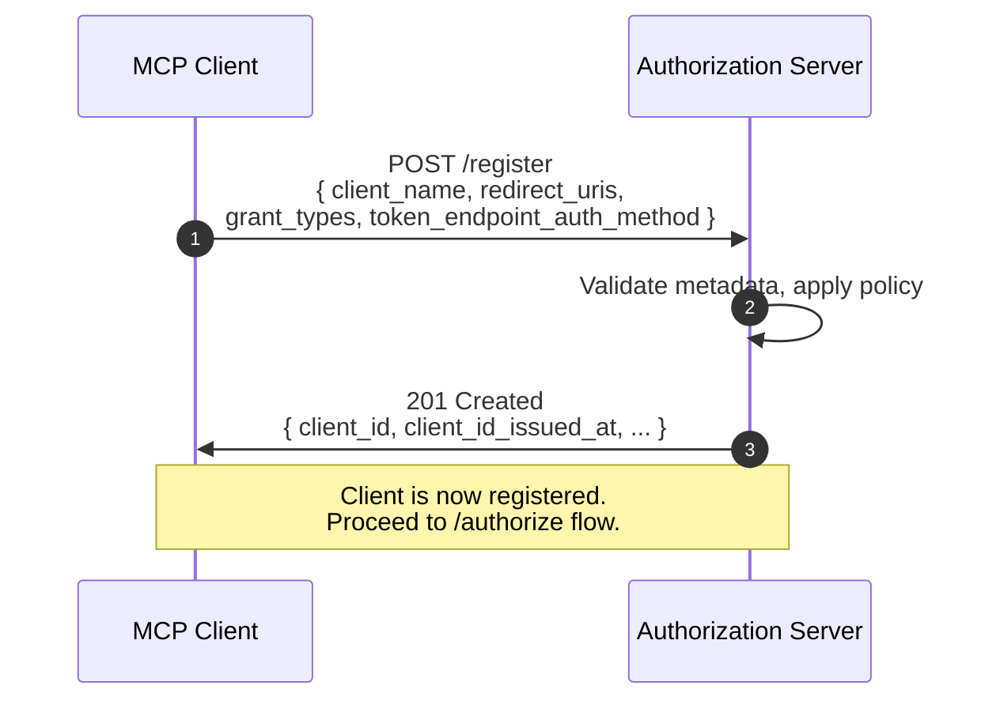
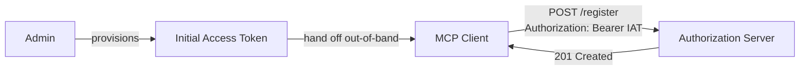

# 10.3 Dynamic Client Registration in MCP (RFC 7591)

> **In one line:** How a brand-new app introduces itself to the login service automatically, with no human setting it up first.
>
> **Why it matters:** Without it, someone would have to manually register every app-and-tool combination in advance — which would never scale to a whole ecosystem.

> **Update for 2025-11-25 spec.** DCR is no longer the *preferred* registration mechanism. The current MCP spec positions [**Client ID Metadata Documents (CIMD)**](09-agent-pattern-end-to-end.md#1094-client-registration--three-paths-in-priority-order) as the recommended approach; DCR is kept "for backwards compatibility or specific requirements." The full priority order (pre-registration → CIMD → DCR → user-prompt) is covered in detail on the [Agent / MCP end-to-end](09-agent-pattern-end-to-end.md) page. This page still describes DCR accurately — but new MCP implementations should reach for CIMD first.

The catch in any MCP deployment: **MCP clients are unknown to the AS until they try to connect**. There is no human in the loop to provision an OAuth app for "Claude Desktop talking to your GitHub MCP server" before the conversation starts. The user expects to plug in a URL and have it work.

**RFC 7591 — Dynamic Client Registration** solves this.

## The sequence



## HTTP

```http
POST /register HTTP/1.1
Host: login.example.com
Content-Type: application/json

{
  "client_name":                "Claude Desktop (Philippe's laptop)",
  "redirect_uris":              ["http://127.0.0.1:51247/cb"],
  "grant_types":                ["authorization_code", "refresh_token"],
  "response_types":             ["code"],
  "token_endpoint_auth_method": "none",
  "scope":                      "mcp:tools.read mcp:tools.invoke"
}
```

```http
HTTP/1.1 201 Created
Content-Type: application/json

{
  "client_id":            "mcp-cli-abc123",
  "client_id_issued_at":  1748352000,
  "redirect_uris":        ["http://127.0.0.1:51247/cb"],
  "grant_types":          ["authorization_code", "refresh_token"],
  "response_types":       ["code"],
  "token_endpoint_auth_method": "none"
}
```

The MCP spec says clients **MAY** support DCR — it's optional but expected for most ecosystem deployments. Without DCR you're stuck pre-provisioning a client for every (user, MCP server, AS) combination, which doesn't scale.

## When DCR isn't open

Enterprise IdPs typically don't allow open DCR — anyone POSTing valid JSON shouldn't be able to register. Two RFC 7591 mechanisms gate it:

**Initial access token.** Admin issues a one-time bearer token that the client presents as `Authorization: Bearer …` at `/register`. The AS validates the token and applies admin-configured defaults to the resulting registration.



**Software statement.** A signed JWT issued by a trusted authority (the MCP server vendor, the device manufacturer, etc.) describing properties of the client. The AS validates the signature and may auto-approve registrations that match a policy.

```http
POST /register HTTP/1.1
Content-Type: application/json

{
  "client_name":       "...",
  "redirect_uris":     [...],
  "software_statement":"eyJhbGciOiJSUzI1NiJ9..."   ← signed JWT
}
```

## DCR for local (loopback) clients

MCP CLIs and desktop apps typically use loopback redirects: `http://127.0.0.1:<random-port>/cb`. RFC 8252 (OAuth 2.0 for Native Apps) covers this pattern. Key rules the AS should enforce:

- Permit `http://127.0.0.1` and `http://[::1]` (IPv6 loopback) as exact-match redirect URIs.
- Permit `localhost` only if the AS understands it as a literal-string compare, not a DNS lookup.
- Permit any port number (the client picks at runtime to avoid collisions).
- Reject anything that's not loopback for `http` schemes.

## The other half — RFC 7592

RFC 7592 (Dynamic Client Management) lets a registered client read, update, and delete its own registration via a `registration_access_token` returned at registration time. MCP clients should support this for credential rotation and clean uninstall paths.

## Why DCR matters specifically for MCP

The MCP ecosystem assumes clients show up unannounced. A user installs an IDE plugin, types in an MCP server URL, and expects it to work. Without DCR, that experience requires an admin to provision an app in the AS console first — which immediately kills ecosystem velocity. **DCR is what turns OAuth from "configure once per app" to "configure once per AS, then plug in any client."**

---

← [Discovery chain](02-discovery-chain.md) · ↑ [MCP](README.md) · → Next: [Resource indicators](04-resource-indicators.md)
