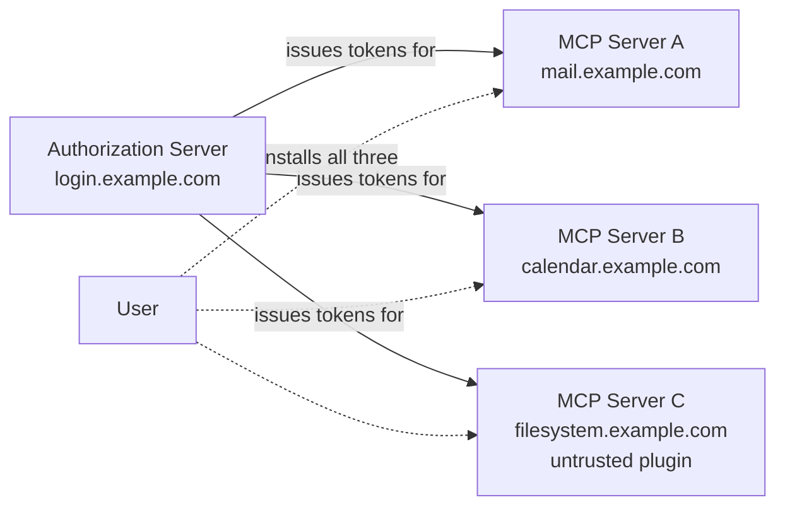
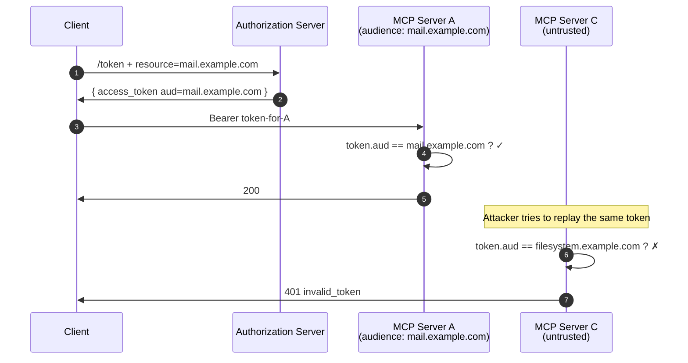
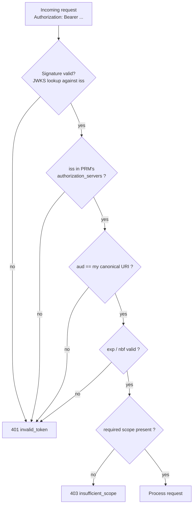

# 9.4 Resource indicators — RFC 8707 and audience binding

**This is the rule that surprises people:** MCP clients **MUST** include the `resource` parameter (RFC 8707) on both the authorization request and the token request, set to the canonical URI of the MCP server they intend to call.

## The confused-deputy problem

Imagine a user has tokens from one AS that serves three MCP servers:



Without audience binding, a token issued for the filesystem MCP server (which the user installed without much thought) can be replayed against the mail MCP server. **The malicious filesystem plugin steals the user's mail.** This is the OAuth-flavoured confused deputy.

The defence is two parts:

1. The client **declares** the intended audience at issuance: `resource=https://mail.example.com`.
2. The MCP server **validates** the token's `aud` claim equals its own canonical URI.



## On the wire

The `resource` parameter on `/authorize`:

```http
GET /authorize?
    response_type=code
    &client_id=mcp-cli-abc123
    &resource=https%3A%2F%2Fmail.example.com
    &scope=mcp:tools.invoke
    &code_challenge=...
    &state=...&redirect_uri=... HTTP/1.1
Host: login.example.com
```

And again on `/token`:

```http
POST /token HTTP/1.1
…
grant_type=authorization_code
&code=...
&code_verifier=...
&resource=https%3A%2F%2Fmail.example.com
```

## The token

A token presented at the MCP server should look (decoded) like:

```json
{
  "iss":       "https://login.example.com",
  "sub":       "user-7b8c…",
  "aud":       "https://mail.example.com",
  "client_id": "mcp-cli-abc123",
  "scope":     "mcp:tools.invoke",
  "exp":       1748355600,
  "iat":       1748352000,
  "jti":       "..."
}
```

The `aud` claim **must** equal the MCP server's canonical URI (the same value its PRM document published as `resource`).

## What the MCP server enforces

On every request, the MCP server validates:



The order matters. Validate `iss` *before* using the token's claims to look anything up — a token with a forged `iss` can't be allowed to direct the validation to attacker-controlled JWKS.

## Why this is non-negotiable in the MCP spec

Most OAuth deployments historically had one resource server per AS, so audience binding was less urgent — `aud` was just the API's name and any token for that AS was implicitly for that API. The MCP ecosystem has the **opposite** topology: many MCP servers, one (or a few) AS per user. Without RFC 8707 + strict audience validation, a single compromised MCP server's tokens grant access to *every* MCP server the user has connected.

The 2025-11-25 MCP spec tightened the language around resource-parameter handling. It is now **REQUIRED** on token requests; servers **MUST** reject tokens with a non-matching `aud`. Some ASes (notably some early Entra ID configurations) emit tokens without a tight `aud` by default — these need explicit policy configuration to be MCP-conformant.

---

← [DCR](03-dynamic-client-registration.md) · ↑ [MCP](README.md) · → Next: [The full handshake](05-handshake.md)
