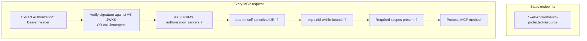
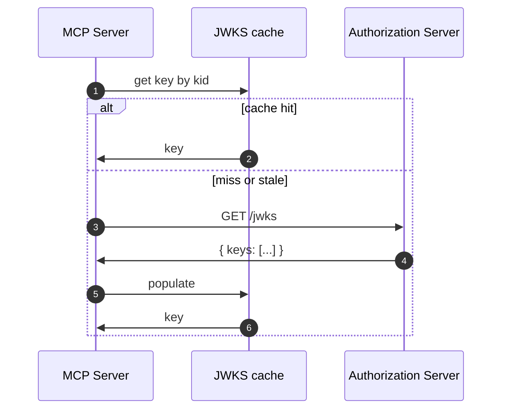

# 10.6 What an MCP server actually has to implement

> **In one line:** A practical checklist of what a tool actually has to build in order to accept these access passes safely.
>
> **Why it matters:** It turns out to be surprisingly little — mostly checking passes. This page is for anyone who has to write that code.

The MCP server's auth code is mostly **token validation** — a few hundred lines, not a few thousand. The AS does the heavy lifting (login, MFA, consent, token issuance, DCR).

Here is the concrete minimum-bar checklist.

## Server-side responsibilities



## 1. Serve `/.well-known/oauth-protected-resource`

Static or near-static. Return JSON per RFC 9728 with at minimum:

```json
{
  "resource":              "https://mcp.example.com",
  "authorization_servers": ["https://login.example.com"],
  "scopes_supported":      ["mcp:tools.read", "mcp:tools.invoke"],
  "bearer_methods_supported": ["header"]
}
```

The `resource` value is the **canonical URI** of the MCP server. It MUST match what the server expects to see in incoming tokens' `aud` claim. Pick one canonical form (with or without trailing slash, with or without a path) and stick with it — clients use exact-string matching.

## 2. Validate every incoming token

```python
# Illustrative — language agnostic
def validate(token: str, request_path: str) -> Claims:
    header, payload, sig = decode_jwt(token)

    # 1. Signature
    key = jwks.get_key(header.kid)              # from cached AS JWKS
    verify_signature(token, key)

    # 2. iss against our trusted PRM list
    if payload.iss not in PRM_TRUSTED_ISSUERS:
        raise InvalidToken("iss not trusted")

    # 3. aud must contain *our* canonical URI
    if MY_CANONICAL_URI not in as_list(payload.aud):
        raise InvalidToken("aud mismatch")

    # 4. Time bounds
    now = utcnow()
    if payload.exp < now or payload.nbf > now:
        raise InvalidToken("expired or not yet valid")

    # 5. Scope sufficiency depends on the operation
    return payload
```

The order matters. **Verify the signature first**, then trust the claims. Otherwise an attacker can forge an `iss` and steer your validation to attacker-controlled JWKS.

## 3. Respond with the right errors

The error responses are part of the discovery chain — clients use them to drive recovery.

```http
HTTP/1.1 401 Unauthorized
WWW-Authenticate: Bearer error="invalid_token",
    error_description="The token's audience does not match this resource",
    resource_metadata="https://mcp.example.com/.well-known/oauth-protected-resource"
```

```http
HTTP/1.1 403 Forbidden
WWW-Authenticate: Bearer error="insufficient_scope",
    scope="mcp:tools.invoke",
    resource_metadata="..."
```

Putting `resource_metadata=` on every 401/403 is the recommended pattern — clients use it to re-resolve discovery if the AS or scopes have changed.

## 4. Cache the AS's JWKS (but with TTL)

Fetching JWKS on every request is a disaster — the AS becomes a hot dependency. Fetch once, cache, refetch on TTL or on signature-verification failure with an unknown `kid`. Typical TTL: 5–60 minutes.



## 5. Don't cache token validity beyond `exp`

A user revoking access at the AS console expects it to stop working within the token's expiry window. Don't extend that window by caching "token is valid" results.

If you need *immediate* revocation, use [token introspection](../05-tokens.md#token-introspection-rfc-7662) instead of JWT validation — at the cost of an AS round-trip per request, mitigated by short-TTL introspection caching.

## What you do NOT need to implement

- **`/authorize`** — not on the MCP server. Lives on the AS.
- **`/token`** — same.
- **`/register`** — same.
- **`/jwks`** — same.
- **User account database** — the MCP server should treat `sub` as opaque and store any per-user state keyed by `(iss, sub)`.
- **Session cookies** — bearer tokens are the only credential.
- **Password handling, MFA, consent screens** — all the AS's job.

That's the win of the role split. Your MCP server's auth surface is just token validation.

## Library landscape (May 2026)

Most major frameworks now have an "MCP authorization" middleware:

- **Python:** `fastmcp` has built-in OAuth resource-server middleware that handles PRM and token validation.
- **TypeScript / Node:** the official MCP SDK has equivalent middleware.
- **Go / Java / .NET:** community packages or roll-your-own using standard JWT libraries (`jose-go`, `nimbus-jose-jwt`, `Microsoft.IdentityModel.Tokens`).

Use the middleware. The five validation steps above are exactly what you want to *not* hand-implement.

---

← [Handshake](05-handshake.md) · ↑ [MCP](README.md) · → Next: [Pitfalls](07-pitfalls.md)
