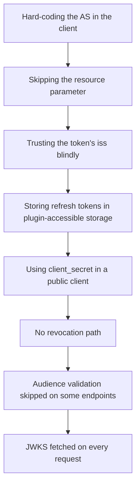

# 10.7 Common MCP-auth pitfalls

A field guide to the failure modes that actually show up.

## 1. Hard-coding the AS in the client

**Symptom:** the MCP client ships with `https://login.example.com` baked in.

**Why it's wrong:** defeats the whole discovery chain. Every MCP server has its own PRM document listing its trusted ASes. The client must read it.

**Fix:** always start from the MCP server URL, follow the PRM → AS metadata chain.

## 2. Skipping the `resource` parameter

**Symptom:** token request omits `resource=…`, AS issues a token without a tight `aud`, or with `aud` set to the AS's own issuer URL.

**Why it's wrong:** the token becomes usable at any MCP server the AS issues for. Confused-deputy bait.

**Fix:** every `/authorize` and `/token` request includes `resource=<MCP server canonical URI>`. The server validates `aud` matches.

## 3. Trusting the token's `iss` blindly

**Symptom:** server-side validation pulls the `iss` from the token, fetches that URL's JWKS, verifies, and accepts.

**Why it's wrong:** an attacker presents a token signed by their own key, with `iss` pointing to attacker-controlled JWKS. Verification passes — for the wrong key.

**Fix:** the MCP server must check `iss` against *its own* PRM-declared trusted list, not against whatever the token says. JWKS-fetching by `iss` is fine — but only *after* `iss` is on the allowlist.

## 4. Storing refresh tokens in plugin-accessible storage

**Symptom:** MCP client (often a desktop app) stores refresh tokens in plain config files, `localStorage`, or per-plugin-readable storage.

**Why it's wrong:** the MCP client host often runs untrusted MCP servers as subprocesses or other extensions in the same process. Any of them with read access steals the refresh token, which is good for the entire token lifetime.

**Fix:** OS keychain (Keychain on macOS, Credential Manager on Windows, Secret Service on Linux). For server-side clients, encrypted-at-rest secret stores.

## 5. Using `client_secret` in a public client

**Symptom:** an MCP CLI registers itself with `token_endpoint_auth_method: client_secret_basic` and ships the secret in the binary.

**Why it's wrong:** the CLI is a public client. The "secret" is extractable by anyone with the binary, defeating the point.

**Fix:** register with `token_endpoint_auth_method: "none"` and rely on PKCE + audience-bound, short-lived tokens.

## 6. No revocation path

**Symptom:** user revokes the client at the AS console, but their refresh token keeps working for hours because the MCP server caches "this token is valid" for performance.

**Fix:** don't cache token validity beyond `exp`. For immediate revocation, use introspection (with short TTL) instead of JWT-with-long-expiry. Document the revocation path to your users.

## 7. Audience validation skipped on some endpoints

**Symptom:** validation middleware skipped on `/health`, `/metrics`, or one specific MCP method that "doesn't need it."

**Why it's wrong:** if those endpoints are at the same canonical URI, an attacker can probe for them with stolen tokens. Worse, "doesn't need it" tends to drift to "shouldn't have it" silently.

**Fix:** unauthenticated endpoints (health, PRM document itself) get explicit allowlisting in the routing layer, not by accident. Everything else gets validated uniformly.

## 8. JWKS fetched on every request

**Symptom:** every incoming request triggers a fetch of the AS's `/jwks`. The AS becomes a hot dependency, and a small outage there cascades into MCP server unavailability.

**Fix:** cache JWKS for minutes-to-hours, with refresh on `kid` miss or background TTL expiry.

## 9. Wildcard / fuzzy redirect URIs at DCR

**Symptom:** the AS accepts redirect URIs with wildcards or doesn't enforce loopback-only for `http://`.

**Fix:** enforce RFC 8252 for native clients. For loopback redirects, require the `127.0.0.1` literal (not `localhost`) and require an `http://` scheme. Reject anything else.

## 10. Conflating `client_id` with user identity

**Symptom:** server-side code attributes actions to `client_id` and uses it for audit logs or authorization decisions.

**Why it's wrong:** `client_id` is the application. The user is `sub`. In a multi-user MCP host, ten users share the same `client_id` but are ten different `sub`s.

**Fix:** use `(iss, sub)` as the user key. Use `client_id` only when you specifically want to scope behaviour by client (e.g., rate limits per app).

---

← [Server implementation](06-server-implementation.md) · ↑ [MCP](README.md) · → Next: [Beyond bearer](08-beyond-bearer.md)
