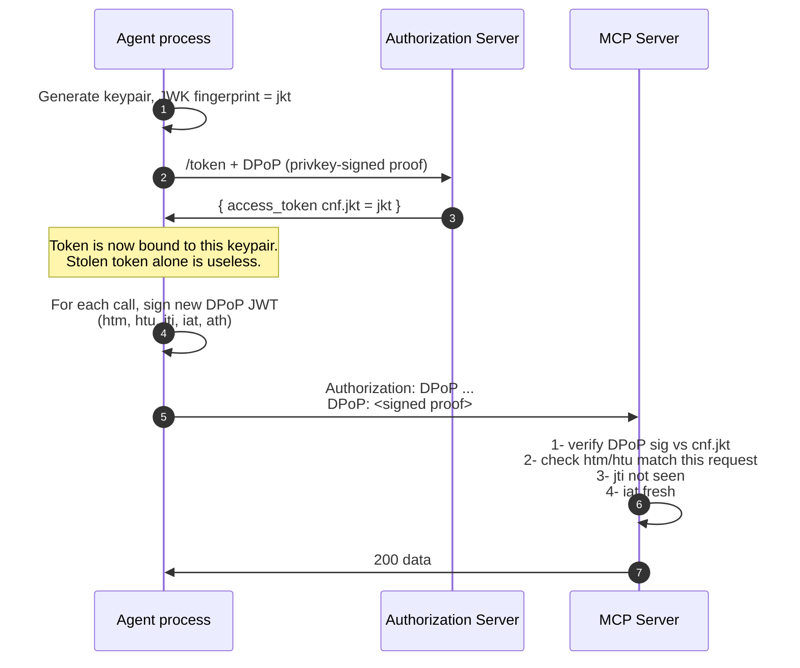
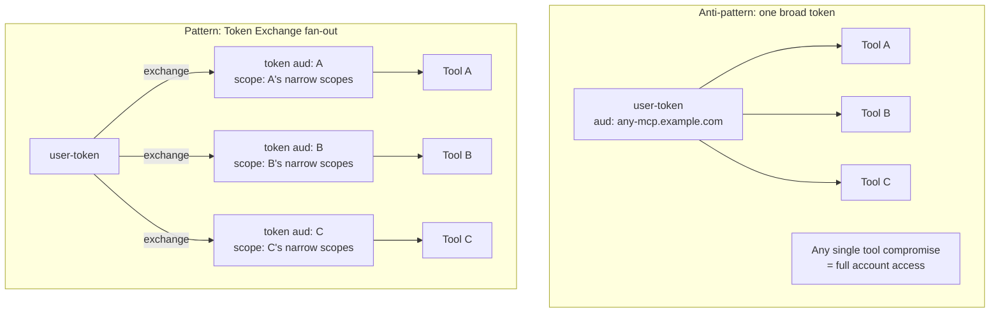

# 9.8 Beyond bearer — DPoP and Token Exchange for agents

Bearer-only tokens are the MCP default in 2026. Two research-leaning patterns are worth tracking because they're appearing in enterprise MCP deployments and are likely candidates for normative inclusion in future spec revisions.

## DPoP for MCP

The threat model the MCP spec defends against today: token theft in transit (mitigated by TLS) and at issuance (mitigated by audience binding, PKCE). The threat it does *not* defend against: **token theft from a long-running agent's process memory**.

An AI agent running for hours has its access tokens sitting in RAM (or worse, in checkpoints to disk). Any code execution in that process — an injected prompt that gets a tool to execute, a vulnerable dependency, a debug build with verbose logging — exposes the token. With bearer-only validation, that token works from anywhere.

DPoP (RFC 9449) cuts this off.

A token stolen from the agent's memory **without the corresponding private key** is unusable elsewhere. The private key is the actual secret to protect — and it's straightforward to keep that in a TPM, secure enclave, or OS-level key store while the access token sits in process memory.

The 2026-07-28 MCP release candidate touches this territory; production MCP deployments at the bank/healthcare end of the spectrum are already implementing it on top of the current spec.

## Token Exchange for agent fan-out

When an agent invokes ten tools on a user's behalf, the question is: what audience does each tool's token carry?

The agent holds one upstream token, then mints per-tool tokens via [Token Exchange (RFC 8693)](../flows/token-exchange.md). Each per-tool token has:

- `aud` = that tool's MCP server URI (cannot be replayed against another tool).
- `scope` narrowed to what that tool actually needs.
- Optionally, `act` claim identifying the agent (delegation, not impersonation) — so the downstream sees both who the user is *and* what's acting on their behalf.

The MCP spec doesn't mandate this yet. But it's the right pattern, and the 2026-07-28 RC has hooks to make it ergonomic — particularly around how an MCP server can advertise its required `aud` and scopes during PRM, so a fan-out coordinator can build the right token-exchange request without per-tool config.

## Step-up authentication (RFC 9470)

A third pattern worth knowing: an MCP tool can demand step-up authentication for a specific operation. RFC 9470 defines how a resource server returns a 401 with `WWW-Authenticate: Bearer error="insufficient_user_authentication"`, indicating to the client that the user needs to re-authenticate with stronger assurance (e.g., MFA, recent re-auth).

This is how you build "let the AI agent read your mail freely, but require MFA confirmation before it sends money." The MCP server triggers the step-up, the client surfaces it to the user, the user re-authenticates with the AS, and the resulting token carries the elevated `acr`/`amr` claims.

## What's still ahead

The MCP working group's open conversations include:

- **Mandatory sender-constraint** in a future spec revision (DPoP at minimum).
- **First-class delegation semantics** so multi-agent orchestration (one agent calling another) is auditable.
- **Tighter coupling with [OIDC](../08-oidc.md)** for the human-identity side, particularly around `acr`/`amr` propagation for step-up.

The pattern across all of these: **OAuth 2.1 + supporting RFCs already provide the mechanisms**. The MCP profile's job is to pick which ones are mandatory, and the trend is consistently in the direction of "more, sooner."

---

← [Pitfalls](07-pitfalls.md) · ↑ [MCP](README.md) · → Next: [Security considerations](../11-security.md)
