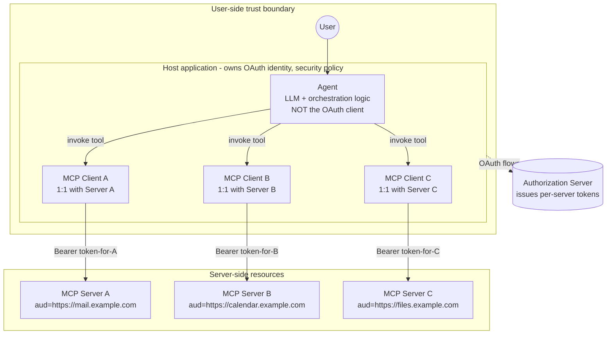
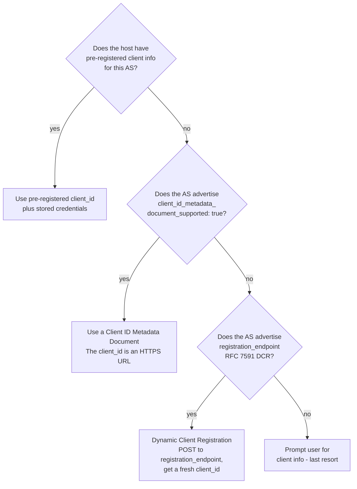
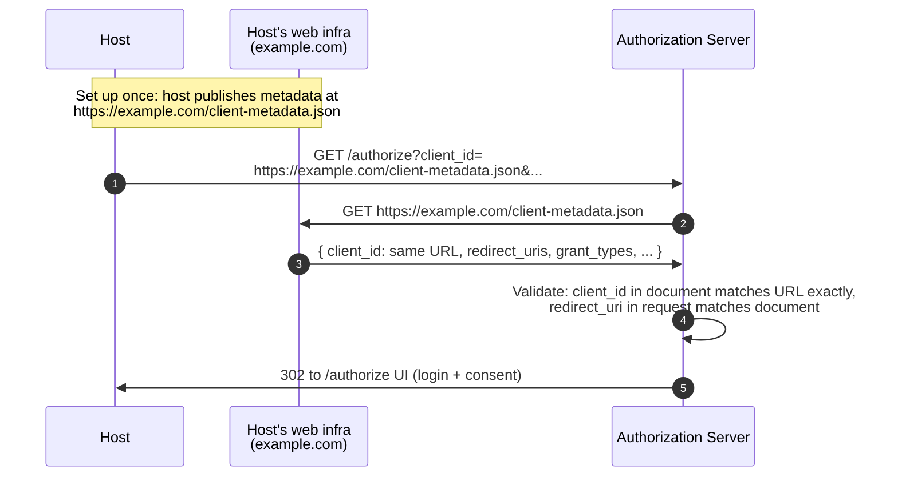
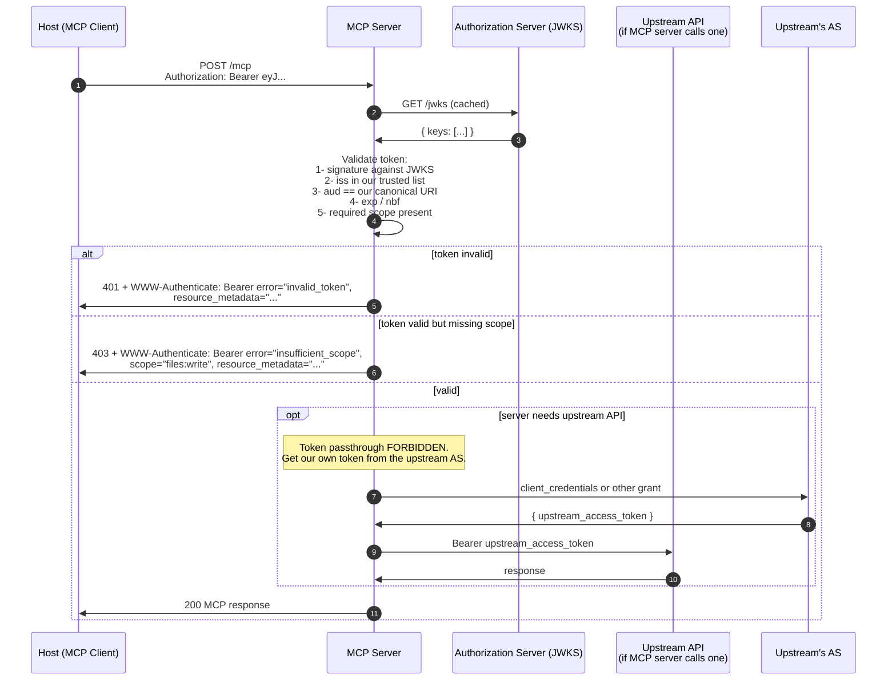
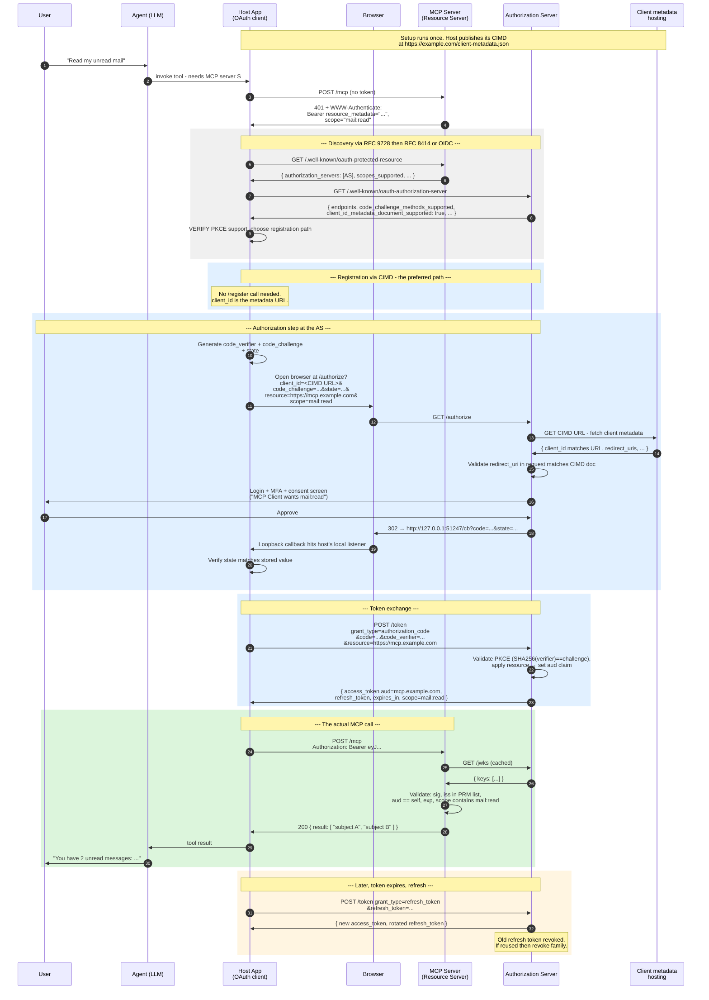
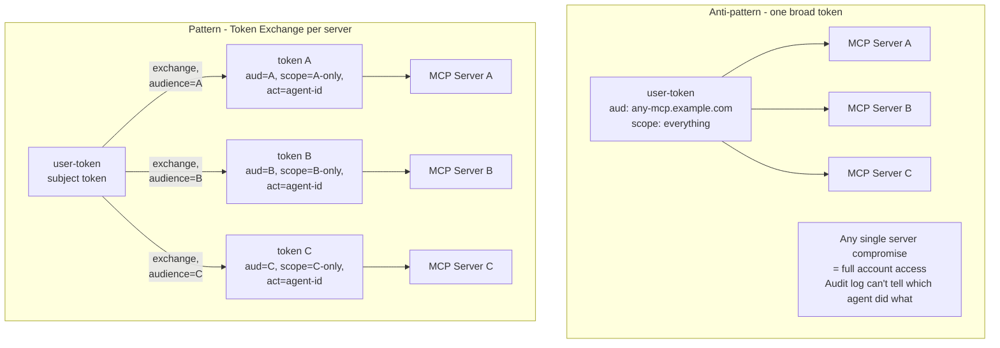
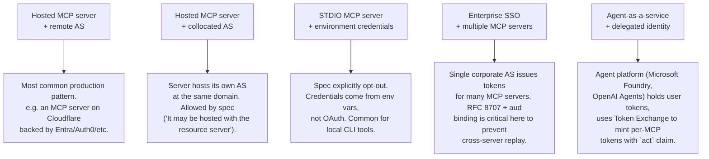

# 9.9 The Agent / MCP pattern — OAuth 2.1 end to end

> *This page is a 100%-spec-accurate, end-to-end walkthrough of how OAuth 2.1 authorisation works in the MCP **Agent pattern** — where an AI agent (running inside a host application) needs to invoke tools on one or more MCP servers on behalf of a human user. It draws directly from the **MCP 2025-11-25 specification (Authorization)** and the upcoming **draft revision**, both of which reference **OAuth 2.1 draft-ietf-oauth-v2-1-13** as their normative base.*
>
> *If you are skim-reading, jump straight to [§9.9.7 The full end-to-end sequence diagram](#9-9-7-the-full-end-to-end-sequence-diagram).*

This is the deepest treatment in the guide. Other pages set things up:

- The OAuth 2.1 base mechanism — [§4.1 Authorization Code + PKCE](../flows/authorization-code-pkce.md).
- The discovery chain at a high level — [§9.2 Discovery chain](02-discovery-chain.md).
- Why MCP is a resource server, not its own AS — [§9.1 Architecture](01-architecture.md).
- Why tokens must be audience-bound — [§9.4 Resource indicators](04-resource-indicators.md).
- Forward-looking sender-constraint and Token Exchange — [§9.8 Beyond bearer](08-beyond-bearer.md).

This page consolidates those into one continuous story, with explicit focus on what changes when the *caller* is an **agent**, not a human at a browser.

---

## 9.9.1 The MCP architecture, in one paragraph

MCP defines a **host → client → server** topology, not the simpler client → server of most OAuth deployments. The **host** (Claude Desktop, an IDE, an agent runtime) is the trust boundary and the OAuth client identity. Inside the host, the **agent** (the LLM with tool-use logic) decides which tools to call. The host owns one **MCP client per server** — each client maintains a stateful JSON-RPC session and a per-server audience-bound access token. The **MCP server** is a pure OAuth 2.1 resource server, validating tokens and exposing tools, resources, and prompts.



Three things to pin down from this:

1. **The agent is not the OAuth client.** The host is. The agent runs inside the host, uses MCP clients (which the host instantiates) to reach MCP servers, but never directly holds an OAuth registration. This matters because OAuth client identity (`client_id`) attaches to the *application*, not the in-application LLM logic.
2. **One token per MCP server.** The host's OAuth client may obtain *N* tokens — one for each MCP server the agent calls. Each token's `aud` claim binds it to exactly one server, so the same machinery cannot be reused as cross-server replay. This is RFC 8707 in action.
3. **The agent's identity is a separate concept** from the OAuth client identity. In the simple pattern, the agent is implicit (the AS sees only `(client_id, sub=user)` and the agent's behaviour shows up in audit logs as "the client did X"). In the [Token Exchange pattern](#9-9-8-the-agent-pattern-token-exchange-and-the-act-claim), the agent is explicitly encoded in the token's `act` claim.

---

## 9.9.2 What the spec actually requires (2025-11-25)

This list is verbatim from [the 2025-11-25 spec](https://modelcontextprotocol.io/specification/2025-11-25/basic/authorization). The MUST/SHOULD/MAY come from the spec text:

1. **Authorization servers MUST implement OAuth 2.1** — referenced as draft-ietf-oauth-v2-1-13.
2. **Authorization servers and MCP clients SHOULD support [OAuth Client ID Metadata Documents (CIMD)](https://datatracker.ietf.org/doc/html/draft-ietf-oauth-client-id-metadata-document-00)** — this is the **preferred** registration mechanism going forward.
3. **Authorization servers and MCP clients MAY support OAuth 2.0 Dynamic Client Registration (RFC 7591)** — kept "for backwards compatibility or specific requirements."
4. **MCP servers MUST implement [Protected Resource Metadata (RFC 9728)](https://datatracker.ietf.org/doc/html/rfc9728)** and **MCP clients MUST use it for authorization-server discovery.**
5. **MCP authorization servers MUST provide at least one of**: OAuth 2.0 Authorization Server Metadata (RFC 8414) **or** OpenID Connect Discovery 1.0. **MCP clients MUST support both** discovery mechanisms.
6. **MCP clients MUST implement [Resource Indicators (RFC 8707)](https://www.rfc-editor.org/rfc/rfc8707.html)** — the `resource` parameter MUST be present on both the authorization request and the token request, regardless of whether the AS supports it.
7. **MCP servers MUST validate the audience** of incoming tokens against their own canonical URI.
8. **PKCE is required.** Clients MUST verify AS support for PKCE via `code_challenge_methods_supported` in the AS metadata. If absent, the client **MUST refuse to proceed**. `S256` is required when technically capable.
9. **Token passthrough is explicitly forbidden.** If the MCP server itself calls an upstream API, it MUST obtain its own separate access token from that upstream's AS — it MUST NOT forward the token it received from the MCP client.
10. **STDIO transport SHOULD NOT use this spec.** STDIO-transport MCP servers get credentials from the environment. The OAuth profile applies to HTTP-based transports (Streamable HTTP, SSE).

---

## 9.9.3 Discovery — RFC 9728 → RFC 8414 (or OIDC)

When the host's MCP client makes its first request to an MCP server without a (valid) token, the server returns `401 Unauthorized` and the client follows a chain to find everything it needs.

```mermaid
sequenceDiagram
    autonumber
    participant H as MCP Host<br/>(OAuth client)
    participant S as MCP Server<br/>(Resource Server)
    participant AS as Authorization Server

    H->>S: POST /mcp (no token)
    S->>H: 401 + WWW-Authenticate:<br/>Bearer resource_metadata="https://mcp.example.com/<br/>.well-known/oauth-protected-resource",<br/>scope="files:read"

    H->>S: GET /.well-known/oauth-protected-resource
    S->>H: { resource, authorization_servers, scopes_supported,<br/>bearer_methods_supported, resource_signing_alg_values_supported }

    Note over H: Pick an authorization_server.<br/>Spec allows multiple; the client decides which one<br/>per RFC 9728 Section 7.6

    H->>AS: GET /.well-known/oauth-authorization-server<br/>(or /.well-known/openid-configuration)

    Note over H,AS: Spec mandates trying both URLs in priority order<br/>for issuer URLs with or without path components.

    AS->>H: { issuer, authorization_endpoint, token_endpoint,<br/>registration_endpoint, jwks_uri,<br/>code_challenge_methods_supported,<br/>client_id_metadata_document_supported, ... }

    Note over H: VERIFY: code_challenge_methods_supported is present.<br/>If absent, MUST refuse to proceed.
```

Two new wire-level details that the 2025-11-25 spec tightened:

- **The `WWW-Authenticate` SHOULD carry a `scope=` parameter** indicating what scopes the requested endpoint requires. The client uses this as the *initial* scope set rather than guessing from `scopes_supported`. This implements least-privilege-by-default.
- **PRM-document discovery may be path-rooted.** A server at `https://example.com/public/mcp` may serve PRM at `https://example.com/.well-known/oauth-protected-resource/public/mcp` (path-appended) **or** at the root `https://example.com/.well-known/oauth-protected-resource`. The client tries both, in that order.

Example wire-level Protected Resource Metadata response:

```http
GET /.well-known/oauth-protected-resource HTTP/1.1
Host: mcp.example.com
```

```http
HTTP/1.1 200 OK
Content-Type: application/json

{
  "resource":                  "https://mcp.example.com",
  "authorization_servers":     ["https://login.example.com"],
  "scopes_supported":          ["mcp:tools.read", "mcp:tools.invoke"],
  "bearer_methods_supported":  ["header"],
  "resource_documentation":    "https://mcp.example.com/docs",
  "resource_signing_alg_values_supported": ["RS256", "ES256"]
}
```

Example wire-level Authorization Server Metadata response:

```http
GET /.well-known/oauth-authorization-server HTTP/1.1
Host: login.example.com
```

```http
HTTP/1.1 200 OK
{
  "issuer":                                  "https://login.example.com",
  "authorization_endpoint":                  "https://login.example.com/authorize",
  "token_endpoint":                          "https://login.example.com/token",
  "registration_endpoint":                   "https://login.example.com/register",
  "jwks_uri":                                "https://login.example.com/jwks",
  "code_challenge_methods_supported":        ["S256"],
  "grant_types_supported":                   ["authorization_code", "refresh_token"],
  "response_types_supported":                ["code"],
  "token_endpoint_auth_methods_supported":   ["none", "client_secret_basic", "private_key_jwt"],
  "client_id_metadata_document_supported":   true,
  "scopes_supported":                        ["openid", "mcp:tools.read", "mcp:tools.invoke"]
}
```

`client_id_metadata_document_supported: true` is how the AS advertises that it supports CIMD — see next section.

---

## 9.9.4 Client registration — three paths, in priority order

This is where the 2025-11-25 spec diverges most from the original (2025-03-26) MCP spec. There are now **three** registration mechanisms, and the spec gives an explicit priority order:



### Path 1 — Pre-registration

The host already has a `client_id` (and optionally a secret) for this AS, registered out-of-band by an administrator. Common in enterprise where IT pre-provisions OAuth apps. The client uses these directly.

The spec adds a subtle but important constraint in the **draft revision**: pre-registered credentials are **tied to a specific AS issuer** and **MUST NOT be reused** with a different AS, even one referenced by the same MCP server's PRM document.

### Path 2 — Client ID Metadata Documents (CIMD) — the new preferred path

CIMD is defined in [draft-ietf-oauth-client-id-metadata-document-00](https://datatracker.ietf.org/doc/html/draft-ietf-oauth-client-id-metadata-document-00). It's the most significant change to MCP authorization since the role split — and the spec adopted it as the **preferred** registration mechanism specifically because it fits the MCP ecosystem's "clients show up unannounced" model better than DCR.

**The idea:** the client hosts a JSON metadata document at an HTTPS URL, and *that URL itself is the `client_id`*. There's no registration step at all — the AS fetches the metadata on demand the first time it sees the URL as a `client_id`.



Example CIMD document (from the spec):

```json
{
  "client_id":     "https://app.example.com/oauth/client-metadata.json",
  "client_name":   "Example MCP Client",
  "client_uri":    "https://app.example.com",
  "logo_uri":      "https://app.example.com/logo.png",
  "redirect_uris": [
    "http://127.0.0.1:3000/callback",
    "http://localhost:3000/callback"
  ],
  "grant_types":                ["authorization_code"],
  "response_types":             ["code"],
  "token_endpoint_auth_method": "none"
}
```

**Why this matters for MCP specifically:**

- **No registration roundtrip.** Skip the `POST /register` step entirely.
- **Portable across ASes.** The same `client_id` URL works at every CIMD-supporting AS — no need to re-register when an MCP server's AS changes.
- **No persistent state for the client.** The host doesn't need to remember per-AS `client_id` values; the URL is the identity.
- **The user sees a meaningful client name.** The metadata document's `client_name` and `logo_uri` are what the consent screen displays — phishing-resistant because the AS validates the document at the URL claimed.

**Security considerations:**

- The AS fetches a URL the client supplies → SSRF risk. ASes MUST validate the URL and apply SSRF protections.
- Localhost-only redirect URIs cannot be uniquely attributed to a specific client even with CIMD, because anyone can host a metadata document and bind to `127.0.0.1`. ASes SHOULD display warnings and MAY require additional attestation.
- ASes MUST validate that the `client_id` value *inside* the fetched document equals the URL used to fetch it. Otherwise an attacker could host malicious metadata claiming to be someone else's `client_id`.

### Path 3 — Dynamic Client Registration (RFC 7591)

DCR remains in the spec as a fallback. The host POSTs its metadata to `/register` and gets back a fresh `client_id` (and possibly a secret).

```http
POST /register HTTP/1.1
Host: login.example.com
Content-Type: application/json

{
  "client_name":                "Claude Desktop (Philippe's laptop)",
  "redirect_uris":              ["http://127.0.0.1:51247/cb"],
  "grant_types":                ["authorization_code", "refresh_token"],
  "response_types":             ["code"],
  "token_endpoint_auth_method": "none",
  "application_type":           "native",
  "scope":                      "mcp:tools.read mcp:tools.invoke"
}
```

```http
HTTP/1.1 201 Created
{
  "client_id":           "mcp-cli-abc123",
  "client_id_issued_at": 1748352000,
  "redirect_uris":       ["http://127.0.0.1:51247/cb"],
  "grant_types":         ["authorization_code", "refresh_token"]
}
```

The **draft revision** adds a constraint not in the original RFC 7591: clients SHOULD specify `application_type` ("native" for desktop/CLI/loopback redirects, "web" for remote browser apps). OIDC-aware ASes enforce different redirect-URI rules depending on this — omitting it defaults to "web", which can break native-style redirects.

### Path 4 — Prompt the user

Last resort, when no automatic mechanism works: the host shows the user a UI asking them to manually paste `client_id` (and maybe `client_secret`). The spec retains this for awkward configurations.

### Why the order matters

The host should choose deterministically. Spec-mandated priority:

1. Pre-registered (if available)
2. CIMD (if AS advertises it)
3. DCR (if AS advertises a registration_endpoint)
4. Prompt user

Skipping a level only if the AS doesn't support it.

---

## 9.9.5 The authorization step — same OAuth 2.1, MCP-specific parameters

This is the *user-at-AS* part of the flow — see [§2 Vocabulary](../02-concepts-vocabulary.md#the-authorization-step--where-the-user-comes-in) for the general concept. MCP's specific requirements layered on top:

- **PKCE with `S256` is mandatory.** The host MUST generate `code_verifier` + `code_challenge`, send the challenge at `/authorize`, send the verifier at `/token`. Client MUST refuse to proceed if the AS metadata doesn't advertise PKCE support.
- **`resource` parameter (RFC 8707) on BOTH `/authorize` AND `/token`.** Identifies the canonical URI of the MCP server. MUST be sent regardless of whether the AS appears to support it.
- **`state` parameter** — required for CSRF protection on the browser leg.
- **Scope set** — initially taken from the `WWW-Authenticate: ... scope="..."` challenge, or from `scopes_supported` in the PRM document.

The wire-level authorization request:

```http
GET /authorize?
    response_type=code
    &client_id=https%3A%2F%2Fexample.com%2Fclient-metadata.json
    &redirect_uri=http%3A%2F%2F127.0.0.1%3A51247%2Fcb
    &scope=mcp%3Atools.invoke
    &state=xyz789
    &code_challenge=E9Melhoa2OwvFrEMTJguCHaoeK1t8URWbuGJSstw-cM
    &code_challenge_method=S256
    &resource=https%3A%2F%2Fmcp.example.com HTTP/1.1
Host: login.example.com
```

After the user authenticates and approves consent, the callback:

```http
HTTP/1.1 302 Found
Location: http://127.0.0.1:51247/cb?
    code=SplxlOBeZQQYbYS6WxSbIA
    &state=xyz789
```

The token exchange:

```http
POST /token HTTP/1.1
Host: login.example.com
Content-Type: application/x-www-form-urlencoded

grant_type=authorization_code
&code=SplxlOBeZQQYbYS6WxSbIA
&redirect_uri=http%3A%2F%2F127.0.0.1%3A51247%2Fcb
&client_id=https%3A%2F%2Fexample.com%2Fclient-metadata.json
&code_verifier=dBjftJeZ4CVP-mB92K27uhbUJU1p1r_wW1gFWFOEjXk
&resource=https%3A%2F%2Fmcp.example.com
```

```http
HTTP/1.1 200 OK
{
  "access_token":  "eyJhbGciOiJSUzI1NiIs...",
  "token_type":    "Bearer",
  "expires_in":    3600,
  "refresh_token": "tGzv3JOkF0XG5Qx2TlKWIA",
  "scope":         "mcp:tools.invoke"
}
```

The decoded access token, by [RFC 9068](https://www.rfc-editor.org/rfc/rfc9068.html) (JWT Profile for OAuth 2.0 Access Tokens):

```json
{
  "iss":       "https://login.example.com",
  "sub":       "user-7b8c-9d4e",
  "aud":       "https://mcp.example.com",
  "client_id": "https://example.com/client-metadata.json",
  "scope":     "mcp:tools.invoke",
  "exp":       1748355600,
  "iat":       1748352000,
  "jti":       "tok-abc-123"
}
```

**`aud == https://mcp.example.com`** is the entire reason RFC 8707 exists. The MCP server's first job on every request is to verify this matches its own canonical URI.

---

## 9.9.6 Token usage and server-side validation

After the token is issued, every MCP request from the host carries it as a Bearer token in the `Authorization` header. The spec is explicit:

- `Authorization: Bearer <token>` in **every** request, even within one logical session.
- Tokens **MUST NOT** appear in URL query strings.
- The MCP server **MUST** validate on every request: signature, `iss`, `aud`, `exp`, scope.
- The MCP server **MUST NOT** accept tokens with the wrong audience.
- The MCP server **MUST NOT** pass through the token to an upstream API — if it needs upstream access, it acts as a *separate* OAuth client at the upstream's AS and obtains its own token.



### Step-up authorization

When the agent attempts an operation that needs a scope it doesn't currently hold, the server returns 403 with the additional scope listed. The host MUST then re-run the authorization step requesting the *union* of currently held scopes and newly challenged scopes (so previously granted permissions aren't lost). The draft revision is explicit that **scope accumulation is a client-side responsibility** — the server emits per-operation challenges; the client unions them.

```http
HTTP/1.1 403 Forbidden
WWW-Authenticate: Bearer error="insufficient_scope",
                  scope="files:write",
                  resource_metadata="https://mcp.example.com/.well-known/oauth-protected-resource",
                  error_description="File write permission required for this operation"
```

---

## 9.9.7 The full end-to-end sequence diagram

This is the one diagram that shows everything for the single-server case. Multi-server fan-out and Token Exchange are in [§9.9.8](#9-9-8-the-agent-pattern-token-exchange-and-the-act-claim).



A few things to notice in the diagram that distinguish the agent pattern:

- **The agent never directly touches the AS or the MCP server.** It expresses intent ("read my unread mail"), the host turns that into protocol activity. The agent doesn't even know `client_id`, `code_verifier`, etc. exist.
- **The host owns the OAuth state.** State, PKCE verifier, refresh token, token cache — all in the host. The agent is a consumer of "yes/no, here's the data" results.
- **The browser appears once**, only at the user-consent step. Everything after the initial authorization is back-channel between host and AS, host and MCP server.

---

## 9.9.8 The agent pattern: Token Exchange and the `act` claim

The preceding section covered the *base* case: one user, one host, one MCP server. The agent pattern gets interesting when:

1. The agent calls **multiple MCP servers** (the typical case — Claude Desktop with five MCP servers connected).
2. We want **the agent to be a first-class identity in the audit trail**, distinguishable from the user.
3. We want **per-tool scope narrowing** — each MCP call gets a token scoped exactly to what that call needs.

The OAuth mechanism for all three is **[Token Exchange (RFC 8693)](../flows/token-exchange.md)**.

### Multi-server fan-out — the naive vs proper pattern



The proper pattern: the host (or a token-broker service) holds an upstream "user token" and, before each MCP call, exchanges it at the AS for a per-server, per-scope token. Each per-tool token has:

- `aud` matching exactly one MCP server's canonical URI.
- `scope` narrowed to what that operation needs.
- `act` claim naming the agent acting on behalf of the user.

### The Token Exchange call

```http
POST /token HTTP/1.1
Host: login.example.com
Content-Type: application/x-www-form-urlencoded

grant_type=urn:ietf:params:oauth:grant-type:token-exchange
&subject_token=<user's upstream JWT>
&subject_token_type=urn:ietf:params:oauth:token-type:access_token
&actor_token=<agent's identity JWT>
&actor_token_type=urn:ietf:params:oauth:token-type:access_token
&audience=https://mail.example.com
&resource=https://mail.example.com
&requested_token_type=urn:ietf:params:oauth:token-type:access_token
&scope=mail:read
```

The decoded resulting token has both identities:

```json
{
  "iss":   "https://login.example.com",
  "sub":   "user-7b8c-9d4e",
  "aud":   "https://mail.example.com",
  "scope": "mail:read",
  "exp":   1748353800,

  "act": {
    "sub":       "agent-expense-report-v2",
    "client_id": "https://example.com/agent-metadata.json"
  }
}
```

**The `act` claim is the entire point.** It says: *"The subject identity is user-7b8c (the human). The actual acting party is the expense-report agent."* MCP servers, RSes, and audit-log consumers can now answer the question "what did the agent do" separately from "what did the user do" — even though the agent acted strictly within the user's authority.

### Multi-hop delegation

When agent A invokes agent B, which then invokes an MCP server, the `act` claim can nest:

```json
{
  "sub": "user-7b8c-9d4e",
  "aud": "https://mail.example.com",
  "act": {
    "sub": "agent-B",
    "act": {
      "sub": "agent-A"
    }
  }
}
```

Read inside-out: agent A delegated to agent B, which is acting on behalf of the user. The full chain of authority is preserved in the token. This composes with the A2A protocol (agent-to-agent communication) where one agent's outbound call to another carries this kind of chained token.

### Why this isn't yet mandatory in MCP

The MCP spec (2025-11-25 and draft) does **not** require Token Exchange — it's still bearer-token-on-the-wire with audience binding as the floor. Token Exchange is the pattern for production deployments that need:

- Per-tool scope tightness (a calendar tool gets a calendar-only token, not a token good for mail too).
- Auditable agent attribution (`act` claims in logs).
- Multi-agent delegation chains.

Adoption is rising fast in enterprise MCP deployments through 2026, and is a likely candidate for inclusion in future MCP spec revisions. The [§9.8 Beyond bearer](08-beyond-bearer.md) page tracks this.

---

## 9.9.9 Common variations of the agent pattern



For each, the spec compliance bar is the same — the wire-level OAuth handshake doesn't change. What changes is:

- **Where the AS lives** (collocated vs separate vs corporate).
- **Whether the agent identity is in `act`** (explicit delegation) or implicit (in the `client_id`).
- **Whether tokens come from one or many ASes** (multi-issuer MCP servers must trust each issuer explicitly).
- **Whether the transport is HTTP** (spec applies) or **STDIO** (spec opts out).

---

## 9.9.10 Pitfalls specific to the agent pattern

Beyond [the general MCP pitfalls](07-pitfalls.md), these are agent-specific:

1. **Treating `client_id` as the agent identity.** The OAuth `client_id` is the host application (Claude Desktop, the IDE, etc.). It is *not* the agent. Audit-logging "client_id did X" tells you the host but not which agent ran. Use the `act` claim for agent attribution; reserve `client_id` for the application.
2. **Passing the user's broad token to every MCP server.** Always per-server-audience tokens (RFC 8707). For production, layer Token Exchange on top.
3. **Letting the agent see refresh tokens.** Refresh tokens belong in the host's secure storage, not in the agent's prompt context. An agent that can see its own refresh token can leak it through a prompt-injection vulnerability.
4. **Reusing the same OAuth client registration across hosts.** Each host (Claude Desktop, an enterprise agent runtime, a developer's CLI) should be a distinct OAuth client identity. Mixing them makes attribution impossible.
5. **Token caching that ignores `exp`.** Agents are long-running; the temptation is to cache tokens beyond their expiry to avoid latency. Don't. Honour `exp` and refresh.
6. **Forwarding tokens from one MCP server to another.** Token passthrough is forbidden by the spec. If MCP server A needs to call MCP server B as part of fulfilling a request, A acts as its own OAuth client to B's AS — it does *not* pass the user's token-for-A to B.
7. **Forgetting that STDIO is opt-out.** A local stdio MCP server should not implement the OAuth flow; it should consume credentials from the environment. Mixing them produces a confusing security model.
8. **Conflating MCP authorisation with the agent's authentication.** The OAuth flow authenticates the *user* to the AS, and authorises the *MCP client* against the *MCP server*. The agent's own identity (Entra Agent ID, SPIFFE SVID, etc.) is a separate concern that may or may not surface in tokens.

---

## 9.9.11 What's coming

The MCP 2026-07-28 release candidate (currently in draft form) is the most substantial revision since launch. Key direction-of-travel items that affect the agent pattern:

- **Tighter alignment with OIDC** — id_token semantics are appearing more prominently in agent flows.
- **OpenID Connect Dynamic Client Registration 1.0** is now referenced alongside RFC 7591 for OIDC-DCR-aware ASes.
- **Authorization Server Binding** — explicit rules that client credentials are scoped per-AS, never reused across ASes (in the draft).
- **Refresh token guidance** is fleshed out — when to issue, when to rotate, `offline_access` opt-in for clients that genuinely need it.
- **`application_type`** at registration distinguishes native (CLI/desktop, loopback redirects) from web clients.
- **Step-up authorization** is now first-class in the spec — clients union previously granted scopes with new challenges rather than overwriting.

And looking further:

- The IETF is working on an **agent-specific OAuth extension** that adds `requested_actor` and `actor_token` parameters to the authorization request, letting the AS *explicitly* issue tokens that name the acting agent. This standardises what Token Exchange does today.
- **A2A protocol** (agent-to-agent) sits alongside MCP, both under Linux Foundation governance. A2A reuses OAuth 2.1 and the same `act` claim pattern for inter-agent calls. MCP is the vertical (agent-to-tool); A2A is the horizontal (agent-to-agent); they compose.

---

## Sources

This page draws normatively from these primary sources (all verified at publication):

- **MCP Authorization spec, 2025-11-25** — [modelcontextprotocol.io/specification/2025-11-25/basic/authorization](https://modelcontextprotocol.io/specification/2025-11-25/basic/authorization)
- **MCP Authorization spec, draft revision** — [modelcontextprotocol.io/specification/draft/basic/authorization](https://modelcontextprotocol.io/specification/draft/basic/authorization)
- **MCP Architecture, 2025-11-25** — [modelcontextprotocol.io/specification/2025-11-25/architecture](https://modelcontextprotocol.io/specification/2025-11-25/architecture)
- **OAuth 2.1 draft-ietf-oauth-v2-1-13** — [datatracker.ietf.org/doc/html/draft-ietf-oauth-v2-1-13](https://datatracker.ietf.org/doc/html/draft-ietf-oauth-v2-1-13)
- **RFC 9728 — Protected Resource Metadata** — [rfc-editor.org/rfc/rfc9728](https://www.rfc-editor.org/rfc/rfc9728)
- **RFC 8707 — Resource Indicators** — [rfc-editor.org/rfc/rfc8707](https://www.rfc-editor.org/rfc/rfc8707)
- **RFC 8414 — Authorization Server Metadata** — [rfc-editor.org/rfc/rfc8414](https://www.rfc-editor.org/rfc/rfc8414)
- **RFC 7591 — Dynamic Client Registration** — [rfc-editor.org/rfc/rfc7591](https://www.rfc-editor.org/rfc/rfc7591)
- **RFC 8693 — Token Exchange** — [rfc-editor.org/rfc/rfc8693](https://www.rfc-editor.org/rfc/rfc8693)
- **draft-ietf-oauth-client-id-metadata-document-00** — [datatracker.ietf.org/doc/html/draft-ietf-oauth-client-id-metadata-document-00](https://datatracker.ietf.org/doc/html/draft-ietf-oauth-client-id-metadata-document-00)

---

← [Beyond bearer](08-beyond-bearer.md) · ↑ [MCP](README.md) · → [Security considerations](../11-security.md)
