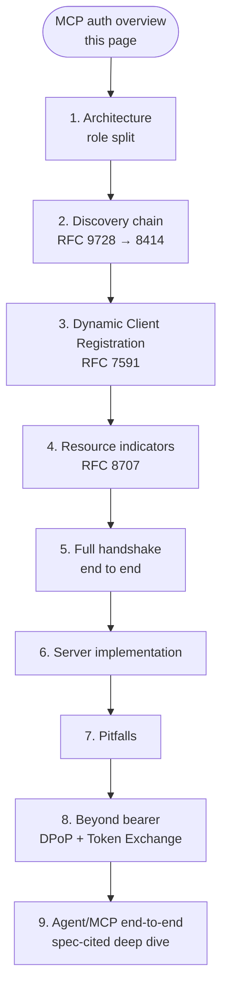
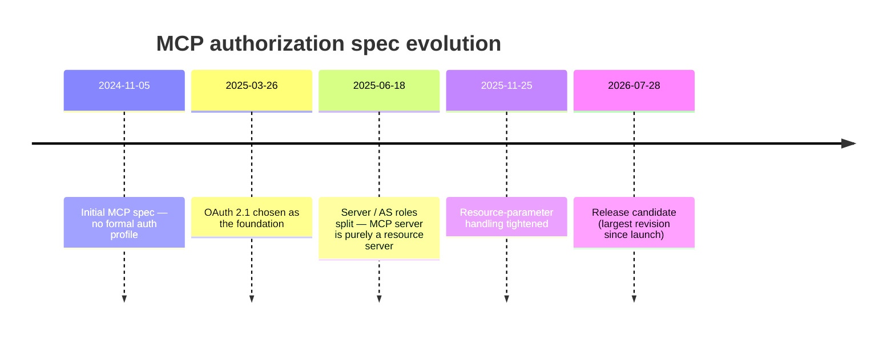

# 9. MCP authorization — overview

The **Model Context Protocol (MCP)** is an open protocol, originally from Anthropic, that defines how AI applications (clients — e.g., Claude Desktop, an IDE plugin, an agent) connect to external tools and data sources (servers — e.g., a GitHub MCP server, a database MCP server).

MCP servers expose **tools**, **resources**, and **prompts**; clients negotiate capabilities and invoke them over JSON-RPC carried by stdio, SSE, or **Streamable HTTP**. As soon as MCP servers started exposing real user data over a network transport, the question *"how do we authorize this?"* became unavoidable — and **OAuth 2.1** is the answer the MCP working group converged on.

This chapter is the long-form treatment of the MCP authorization profile.

## The pages

- 9.1 [Architecture and role split](01-architecture.md) — why the MCP server is *only* a resource server
- 9.2 [The discovery chain](02-discovery-chain.md) — how RFC 9728 and RFC 8414 stitch together
- 9.3 [Dynamic Client Registration in MCP](03-dynamic-client-registration.md) — RFC 7591 in practice
- 9.4 [Resource indicators — RFC 8707 and audience binding](04-resource-indicators.md) — the confused-deputy story
- 9.5 [The full handshake, end to end](05-handshake.md) — discovery → register → authorize → call
- 9.6 [What an MCP server actually has to implement](06-server-implementation.md) — checklist
- 9.7 [Common MCP-auth pitfalls](07-pitfalls.md) — what goes wrong in the wild
- 9.8 [Beyond bearer — DPoP and Token Exchange for agents](08-beyond-bearer.md) — research-leaning
- 9.9 [The Agent / MCP pattern — OAuth 2.1 end to end](09-agent-pattern-end-to-end.md) — the comprehensive, spec-cited walkthrough

## The headline

If you take only one thing from this chapter: **MCP servers are pure OAuth 2.1 resource servers**. They do not authenticate users, do not issue tokens, do not run consent screens. They delegate all of that to an external authorization server they advertise via [RFC 9728 Protected Resource Metadata](02-discovery-chain.md). This decoupling is the single most important architectural choice in the MCP authorization spec, and it's why the protocol composes cleanly with every major identity provider.

## Spec versions you should know

When this guide says "the spec," it means the **2025-11-25 stable** spec unless noted otherwise. The 2026-07-28 RC is referenced for forward-looking material in [§9.8](08-beyond-bearer.md).

---

← [Workload Identity & Agent ID](../09-workload-identity.md) · ↑ [README](../../README.md) · → Next: [Architecture and role split](01-architecture.md)
